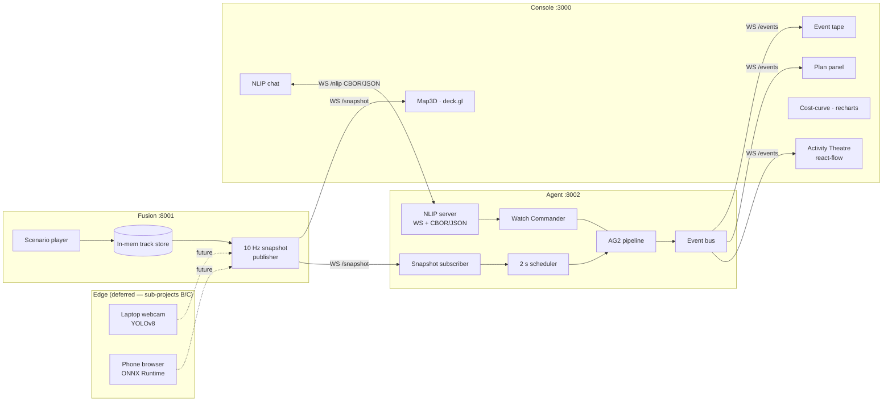
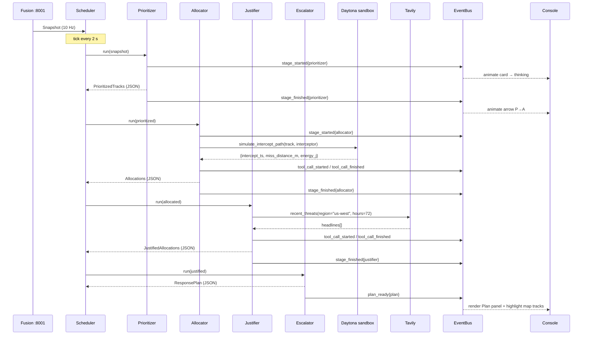

# MeshShield AI

> Software-defined counter-swarm drone defense — four AI agents, one response plan, under 3 seconds.

Built for the **AG2 Hackathon** as a demo-scale slice of a real deployable platform. The system ingests a synthetic airspace snapshot every 100 ms, runs a four-agent AG2 reasoning pipeline every 2 seconds, and streams every decision — with animated provenance — to an operator console in real time.

---

## The Problem: Cost Asymmetry

A Patriot missile battery costs around **$3 million per intercept**. A commercial FPV drone costs **$500**. A swarm of 100 drones costs an adversary $50,000. Against a Patriot, the math is catastrophic for the defender.

Software-defined defense flips the curve: the marginal cost of reasoning about the 100th drone is zero once the intelligence infrastructure exists. MeshShield is that infrastructure — an AI-native layer that fuses sensor data, prioritizes threats in real time, and produces a cost-optimized response plan (RF jam vs. kinetic vs. spoof) with full audit trail before any human decision is needed.

See [docs/COST-CURVE.md](docs/COST-CURVE.md) for the full pitch math.

---

## Solution Overview

MeshShield A+F is a working slice of the full platform:

1. **Fusion service** (`:8001`) — replays a pre-baked scenario JSON at 10 Hz, publishing `Snapshot` objects over WebSocket. In production this is replaced by real sensor fusion (Kalman filter — sub-project D).

2. **Agent service** (`:8002`) — subscribes to snapshots, runs the four-agent AG2 pipeline every 2 seconds, broadcasts `AgentEvent` objects, and hosts the Watch Commander via NLIP WebSocket.

3. **Console** (`:3000`) — Next.js 15 operator console with a live 3D airspace map, animated Activity Theatre DAG, NLIP operator chat, cost-curve overlay, and event tape.

---

## System Architecture



---

## One Pipeline Tick



---

## Tech Stack

| Layer | Technology | Role in MeshShield |
|---|---|---|
| **Agent orchestration** | AG2 (`autogen.beta`) | Four-agent pipeline + Watch Commander. Each agent is an `LLMAdapter.ask_json` call with a structured-output system prompt. |
| **LLM** | Gemini 2.5 Flash (pipeline) / Pro (Watch Commander) | Inference via OpenRouter — no GCP account required. |
| **LLM router** | OpenRouter | Translates AG2 `OpenAIConfig` to Gemini API calls; supplies `OPENROUTER_API_KEY`. |
| **Live grounding** | Tavily Search API | Justifier pulls counter-drone news headlines cached per `(region, hour_bucket)`. |
| **Sandboxed tool** | Daytona | Hosts `simulate_intercept_path` FastAPI shim; falls back to local numpy if unreachable. |
| **Operator chat protocol** | NLIP (Ecma-430/432) | WebSocket + CBOR frames; Watch Commander is the backend. Federation hook present. |
| **API framework** | FastAPI + uvicorn | Both Python services (fusion `:8001`, agent `:8002`). |
| **Schema validation** | Pydantic v2 | Generated from JSON Schema; used in both services and tests. |
| **Schema source of truth** | JSON Schema (draft 2020-12) | `packages/protocol/schemas/`. Generates Pydantic + TypeScript types. |
| **Console framework** | Next.js 15 (App Router) | SSR shell; client components for all live panels. |
| **Agent DAG** | react-flow | Activity Theatre — four agent nodes, animated handoff edges. |
| **3D airspace map** | deck.gl + react-map-gl/MapLibre | ScatterplotLayer (tracks) + GeoJsonLayer (asset polygon). |
| **Animations** | Framer Motion | Card state transitions, tool chip slides, escalation modal. |
| **State management** | Zustand (event-sourced) | Single store; `applyAgentEvent` is the pure reducer; replay is free. |
| **Charts** | recharts | Cost-curve overlay (attacker linear, defender flat). |
| **Python tests** | pytest + pytest-asyncio + respx | 52 tests; cassette pattern for deterministic LLM tests. |
| **TS tests** | vitest + @testing-library/react | 20 component + integration tests. |
| **E2E tests** | Playwright | 2 scenario specs. |
| **Package manager** | pnpm workspaces + uv | Polyglot monorepo. |

---

## Quickstart

```bash
# 1. Install all dependencies (Python + Node)
make install

# 2. Copy and fill in secrets
cp .env.example .env
# Required: OPENROUTER_API_KEY
# Optional: TAVILY_API_KEY, DAYTONA_BASE_URL, DAYTONA_API_KEY

# 3. Generate Pydantic + TypeScript types from JSON Schema
make protocol-gen

# 4. Start all three services with hot-reload
make dev
```

Open [http://localhost:3000](http://localhost:3000).

### Individual services

```bash
# Fusion server only
uv run --directory apps/fusion uvicorn fusion.main:app --port 8001 --reload

# Agent service only
uv run --directory apps/agent uvicorn agent.main:app --port 8002 --reload

# Console only
pnpm --filter @meshshield/console dev
```

### Run tests

```bash
# All Python tests (52 collected, no network required)
uv run pytest -q

# Console tests (20 passing)
pnpm --filter @meshshield/console exec vitest run

# E2E (requires running services)
pnpm --filter @meshshield/console exec playwright test
```

---

## Demo Arc — 90-Second On-Stage Walk

| Time | Action | What the audience sees |
|---|---|---|
| 0–5 s | Page loads | 3D map appears; "Hyperscaler DC East" polygon in red; four agent cards appear in DAG layout, all `idle` |
| 5–7 s | First pipeline tick fires | Prioritizer card pulses (thinking), `▸ AG2 · gemini-2.5-flash` badge visible |
| 7–12 s | Allocator active | Daytona tool chip slides in (green); `simulate_intercept_path` result appears |
| 12–17 s | Justifier active | Tavily chip slides in (blue); headline snippet visible |
| 17–22 s | Escalation Officer completes | Plan panel fills with assignments; map tracks turn highlighted |
| 22–30 s | Narrate the cost curve | Attacker line climbs linearly; defender line stays flat — point made |
| 30–50 s | Type NLIP chat | "Why was T-013 not assigned?" — Watch Commander replies with `[snapshot.tracks[…].conf]` citation |
| 50–90 s | Event tape drill-down | Click event at second 14 → Allocator card highlights; judges can interrogate any decision |

---

## Stats & Metrics

| Metric | Value |
|---|---|
| Backend Python tests | 52 collected (pytest) |
| Console TypeScript tests | 20 passing (vitest) |
| E2E Playwright specs | 2 |
| Python LOC (fusion + agent + protocol codegen) | ~1,829 |
| TypeScript/TSX LOC (console + protocol types) | ~970 |
| **Total LOC** | **~2,799** |
| Target pipeline latency (P50) | < 3 s per tick |
| Target pipeline latency (hard cap) | 5 s (logged as warning, next tick uses fresh snapshot) |
| Snapshot publish rate | 10 Hz |
| Agent tick cadence | 2 s |
| Event ring buffer | 200 events (in-memory) |
| Tavily cache TTL | 1 hour per `(region, hour_bucket)` |
| Daytona fallback threshold | 1.5 s timeout |

---

## Learnings

See [docs/LEARNINGS.md](docs/LEARNINGS.md) for the full write-up. Highlights:

- AG2 `autogen.beta` lazy-import pattern keeps tests completely offline — no mocking of import machinery.
- JSON Schema → Pydantic + TypeScript round-trip catches schema drift in CI before it reaches the console.
- Event-sourcing the Zustand store made scenario replay and Playwright E2E trivially derivable from the same event stream.
- NLIP is a wire protocol, not an agent framework. Pairing it with AG2 (AG2 thinks, NLIP speaks at the boundary) is the cleanest separation of concerns.
- Local fallback for Daytona means the demo is resilient — `_sim_sources` badge makes provenance visible.

---

## Future Scope

| Sub-project | What it adds |
|---|---|
| **B** | Laptop webcam sensor node (YOLOv8 detection → `SensorMessage`) |
| **C** | Phone browser sensor node (ONNX Runtime, no install) |
| **D** | Real Mahalanobis + Kalman fusion of multi-sensor detections |
| **E** | 1000-track live-spawn simulation UI |
| **Persistence** | Postgres + pgvector (history), Redis (hot state) |
| **NLIP federation** | Two MeshShield instances coordinating across sites via NLIP coordinator-agent pattern |
| **Real interceptors** | Standardized actuator API replacing the simulation shim |
| **Hardening** | TLS, OAuth2, rate limiting, OpenTelemetry traces |

See [docs/ROADMAP.md](docs/ROADMAP.md) for the full roadmap.

---

## Repo Layout

```
MeshShield AI/
├── apps/
│   ├── fusion/          # Python — airspace state, scenario player, 10 Hz publisher  :8001
│   │   ├── src/fusion/
│   │   └── tests/
│   ├── agent/           # Python — AG2 pipeline, NLIP server, event bus              :8002
│   │   ├── src/agent/
│   │   │   ├── agents/  # prioritizer, allocator, justifier, escalator, watch_commander
│   │   │   ├── llm/     # LLMAdapter, CassetteLLM
│   │   │   ├── nlip/    # NLIP WebSocket + HTTP server
│   │   │   └── tools/   # intercept_sim, tavily, policy, interceptors, operator_query
│   │   └── tests/
│   └── console/         # Next.js 15 — operator console                              :3000
│       ├── app/
│       ├── components/  # Map3D, ActivityTheatre, AgentCard, NlipChat, PlanPanel …
│       ├── lib/         # store, streams, nlip client
│       ├── tests/
│       └── e2e/
├── packages/
│   ├── protocol/        # JSON Schema source-of-truth + Pydantic + TS codegen
│   └── scenarios/       # Scenario JSON files, OSM GeoJSON, policy.json
├── docs/
│   ├── architecture/    # Deep-dive architecture docs (01-05)
│   ├── AG2.md           # AG2 integration deep-dive
│   ├── COST-CURVE.md    # The pitch math
│   ├── LEARNINGS.md     # Build retrospective
│   ├── ROADMAP.md       # What comes next
│   └── STATS.md         # Metrics and coverage
├── Makefile
├── pyproject.toml       # uv workspace root
└── pnpm-workspace.yaml
```

---

## Deeper Docs

| Document | Topic |
|---|---|
| [docs/AG2.md](docs/AG2.md) | AG2 `autogen.beta` integration, `LLMAdapter`, cassette test pattern |
| [docs/architecture/01-system-overview.md](docs/architecture/01-system-overview.md) | Full system architecture with design rationale |
| [docs/architecture/02-agent-pipeline.md](docs/architecture/02-agent-pipeline.md) | AG2 multi-agent pipeline deep-dive |
| [docs/architecture/03-nlip-integration.md](docs/architecture/03-nlip-integration.md) | NLIP (Ecma-430) operator chat boundary |
| [docs/architecture/04-data-flow.md](docs/architecture/04-data-flow.md) | JSON Schema, codegen, WebSocket channels, event-sourced UI |
| [docs/architecture/05-frameworks-used.md](docs/architecture/05-frameworks-used.md) | Every framework mapped to its role |
| [apps/agent/README.md](apps/agent/README.md) | Agent service — marquee doc |
| [apps/fusion/README.md](apps/fusion/README.md) | Fusion service |
| [apps/console/README.md](apps/console/README.md) | Console — Activity Theatre, animations, Zustand |
| [packages/protocol/README.md](packages/protocol/README.md) | JSON Schema codegen flow |
| [packages/scenarios/README.md](packages/scenarios/README.md) | Scenario file format, authoring guide |
| [docs/COST-CURVE.md](docs/COST-CURVE.md) | Cost asymmetry math and pitch story |
| [docs/LEARNINGS.md](docs/LEARNINGS.md) | Build retrospective |
| [docs/ROADMAP.md](docs/ROADMAP.md) | Future sub-projects |
| [docs/STATS.md](docs/STATS.md) | Test counts, LOC, latency targets |
