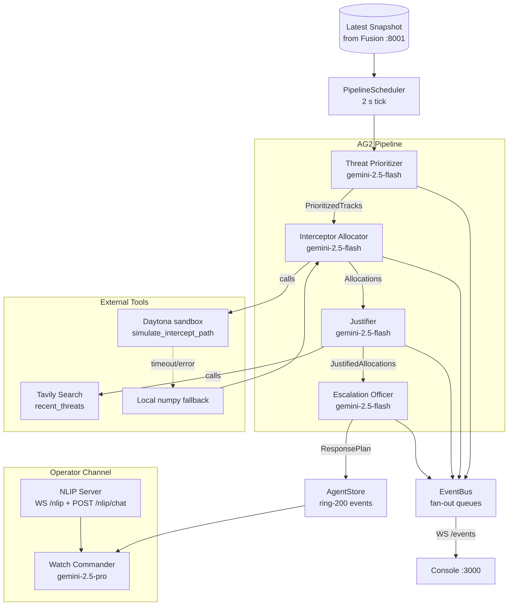
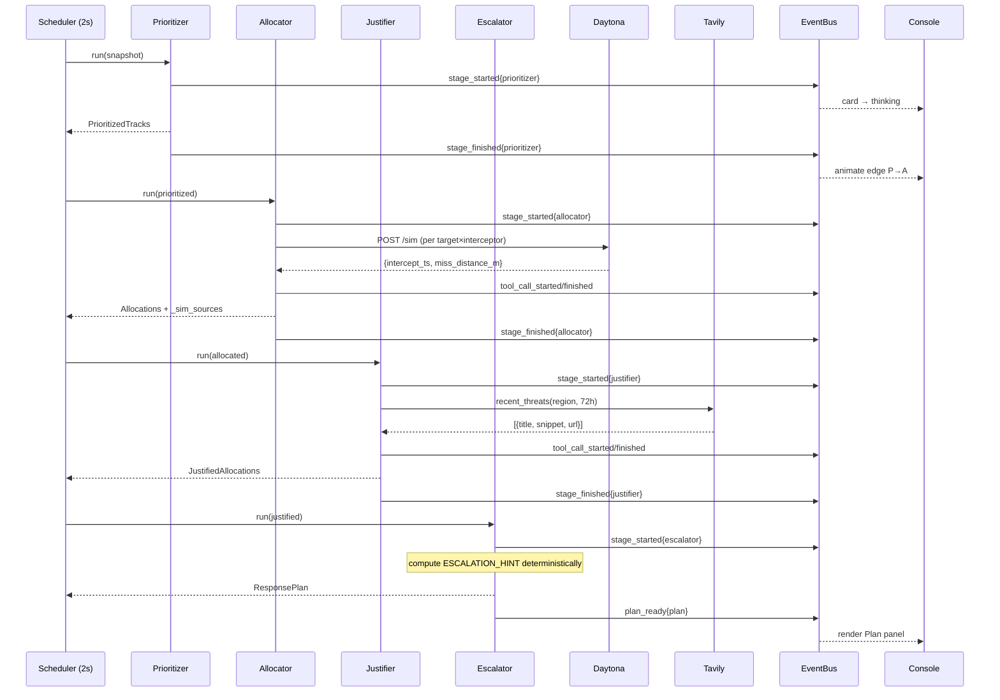
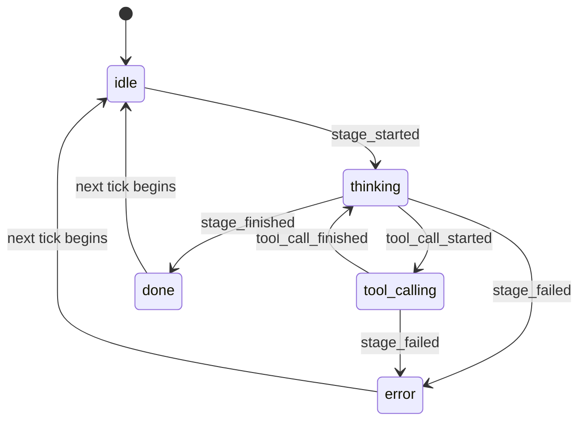

# Agent Service

**Port:** `:8002`  
**Stack:** Python 3.12, FastAPI, uvicorn, AG2 (`autogen.beta`), NLIP  
**Path:** `apps/agent/`

The Agent service is the reasoning core of MeshShield. It subscribes to the Fusion snapshot stream, runs a four-agent AG2 pipeline every 2 seconds, and pushes every decision as structured `AgentEvent` objects over WebSocket. A fifth agent — the Watch Commander — sits behind an NLIP WebSocket and answers operator questions in natural language.

---

## Agent Roles and Data Flow



---

## Files

| File | Description |
|---|---|
| `src/agent/main.py` | FastAPI app factory + lifespan — wires all agents, tools, scheduler |
| `src/agent/server.py` | Route: `GET /health`, `WS /events`, REST shell endpoints |
| `src/agent/pipeline.py` | `Pipeline.run_tick()` — sequential stage runner with bus events |
| `src/agent/scheduler.py` | `PipelineScheduler` — `asyncio.sleep` loop, 2 s default period |
| `src/agent/event_bus.py` | `EventBus` — fan-out queue with late-join replay (50 events) |
| `src/agent/store.py` | `AgentStore` — holds latest snapshot, plan, ring-200 event deque |
| `src/agent/snapshot_subscriber.py` | WebSocket client to Fusion `/snapshot` |
| `src/agent/agents/prioritizer.py` | Threat Prioritizer — sorts tracks by risk score |
| `src/agent/agents/allocator.py` | Interceptor Allocator — matches targets to interceptors via sim |
| `src/agent/agents/justifier.py` | Justifier — produces citation traces using Tavily + policy |
| `src/agent/agents/escalator.py` | Escalation Officer — validates against policy, emits `ResponsePlan` |
| `src/agent/agents/watch_commander.py` | Watch Commander — NL answers with `[citation]` syntax |
| `src/agent/llm/ag2_adapter.py` | `LLMAdapter` — wraps `autogen.beta.Agent`; lazy-import, fallback stub |
| `src/agent/llm/cassette.py` | `CassetteLLM` — deterministic test double (key → string) |
| `src/agent/nlip/server.py` | NLIP HTTP (`POST /nlip/chat`) + WebSocket (`WS /nlip`) handlers |
| `src/agent/tools/intercept_sim.py` | `make_simulate_intercept_path` — Daytona call with local fallback |
| `src/agent/tools/tavily.py` | `make_tavily_recent_threats` — 1-hour bucket cache |
| `src/agent/tools/policy.py` | `make_get_policy_thresholds` — loads `policy.json` |
| `src/agent/tools/interceptors.py` | `make_list_available_interceptors` — reads from scenario JSON |
| `src/agent/tools/snapshot.py` | Utility for snapshot field access |

---

## The AG2 Integration

MeshShield uses [AG2](https://github.com/ag2ai/ag2) (`autogen.beta`) as its LLM orchestration layer. Every agent is implemented as a thin Python class that calls `LLMAdapter.ask_json()` with a carefully constructed system + context prompt.

### LLMAdapter Pattern

```python
# apps/agent/src/agent/llm/ag2_adapter.py

class LLMAdapter:
    def __init__(self, model, llm=None, api_key=None, on_lifecycle=None):
        # If no llm is injected, constructs _AG2LLM on first call.
        # Tests inject CassetteLLM directly — no network required.
        self._llm = llm if llm is not None else _AG2LLM(model=model, api_key=api_key)

    async def ask_json(self, agent_name: str, prompt: str) -> dict:
        text = await self.ask(agent_name, prompt)
        s, e = text.find("{"), text.rfind("}")
        return json.loads(text[s:e+1])   # tolerates fenced code blocks
```

`_AG2LLM` creates one `autogen.beta.Agent` per named agent (keyed by `agent_name`) wired to **OpenRouter** via an `OpenAIConfig` pointing at `https://openrouter.ai/api/v1`. This means a single `OPENROUTER_API_KEY` gives access to Gemini 2.5 Flash and Pro without a GCP account.

```python
class _AG2LLM:
    def _ensure_loaded(self):
        from autogen.beta import Agent
        from autogen.beta.config import OpenAIConfig
        self._cfg = OpenAIConfig(
            model=self._model,
            api_key=key,
            base_url="https://openrouter.ai/api/v1",
        )
    async def ask(self, name, prompt):
        self._ensure_loaded()
        if name not in self._agents:
            self._agents[name] = self._Agent(config=self._cfg, name=name)
        reply = await self._agents[name].ask(prompt)
        return reply.body
```

The lazy import (`from autogen.beta import ...` inside `_ensure_loaded`) means the entire agent service test suite runs offline. Tests inject `CassetteLLM` and never touch autogen's import machinery.

### Cassette Test Pattern

```python
# apps/agent/tests/test_agents_prioritizer.py
from agent.llm.cassette import CassetteLLM
from agent.llm.ag2_adapter import LLMAdapter

SNAPSHOT = {"v":1,"snapshot_id":"s","ts":0,"tracks":[...]}
RESPONSE = '{"prioritized":[{"target_id":"t-001","risk_score":0.9,"intent_estimate":"approach_asset","nearest_asset_m":47.2}]}'

@pytest.mark.asyncio
async def test_prioritizer_happy():
    llm = LLMAdapter("test", llm=CassetteLLM({
        f"prioritizer:{Prioritizer(None).build_prompt(SNAPSHOT)}": RESPONSE
    }))
    p = Prioritizer(llm)
    out = await p.run(SNAPSHOT)
    assert out["prioritized"][0]["risk_score"] == 0.9
```

The cassette key is `f"{agent_name}:{prompt}"`. Tests record the expected prompts once, then the suite is hermetic forever.

---

## The Four Pipeline Agents

### 1. Threat Prioritizer

- **Input:** raw `Snapshot` (all tracks)
- **Output:** `{"prioritized": [{target_id, risk_score, intent_estimate, nearest_asset_m}, ...]}`
- **System prompt contract:** sorts by `risk_score` descending; `intent_estimate` is one of `approach_asset|loiter|withdraw|unknown`
- **No external tools** — pure LLM reasoning over the snapshot

```python
SYSTEM = (
  "You are the MeshShield Threat Prioritizer. Given an airspace snapshot, return a JSON object "
  "with the exact key 'prioritized', sorted by risk_score descending..."
)
```

### 2. Interceptor Allocator

- **Input:** `PrioritizedTracks` from Prioritizer
- **Output:** `{"allocations": [{target_id, interceptor_id, mode, priority}, ...], "_sim_sources": {...}}`
- **External tool:** `simulate_intercept_path(track, interceptor)` — called for every `(target, interceptor)` pair before the LLM call
- **Daytona integration:** the tool factory tries `POST {DAYTONA_BASE_URL}/sim` with a 1.5 s timeout, falling back to a local numpy approximation
- **`_sim_sources` badge:** the allocator annotates which targets were simulated by Daytona vs local fallback — surfaced as a badge in the console

```python
# Simulation results are injected into the LLM prompt, not called by the LLM itself
for itc in self._interceptors:
    r = self._sim(track, itc)   # Daytona or local
    sim_results[tid].append({
        "interceptor_id": itc["id"],
        "intercept_ts": r["intercept_ts"],
        "miss_distance_m": r["miss_distance_m"],
        "source": r.get("source", "local-fallback")
    })
out = await self._llm.ask_json("allocator", self.build_prompt(prioritized, sim_results))
out["_sim_sources"] = {...}
```

### 3. Justifier

- **Input:** `Allocations` from Allocator
- **Output:** `{"justified": [{...allocation, justification: {snapshot_refs, tavily_refs, policy_refs}}, ...]}`
- **External tool:** `tavily_recent_threats(region, hours)` — cached 1 hour per `(region, hour_bucket)`
- **Citation contract:** references use `tracks[2].pos_3d` syntax (snapshot), `headline:` prefix (Tavily), `clause:` prefix (policy)

```python
SYSTEM = (
  "...produce a justification trace that cites: "
  "(a) snapshot field paths (e.g. 'tracks[2].pos_3d'), "
  "(b) tavily headlines (prefix 'headline:'), and "
  "(c) policy clause keys (prefix 'clause:')..."
)
```

### 4. Escalation Officer

- **Input:** `JustifiedAllocations` from Justifier
- **Output:** `ResponsePlan` — the canonical `{v:1, plan_id, snapshot_id, ts, assignments, escalation}` object
- **Deterministic hint:** before calling the LLM, the Escalator computes a rule-based `ESCALATION_HINT` from policy thresholds (confidence gate, nearby-track count). The LLM must reflect this in its output, ensuring the audit trail is always consistent with policy.
- **Defaults:** sets `plan_id = f"plan-{uuid[:8]}"`, `ts = time.time()` if LLM omits them

---

## Watch Commander

The Watch Commander is the fifth agent, exposed exclusively via NLIP WebSocket/HTTP. It differs from the pipeline agents in three ways:

1. **Model:** uses `gemini-2.5-pro` (higher capability for NL conversation)
2. **Context:** builds its prompt from the `AgentStore` — latest snapshot, latest plan, last 20 events
3. **Citation syntax:** trained to wrap references in `[snapshot.tracks[3].pos_3d]`, `[clause:auto_action_min_conf]`, `[plan-0007]` — rendered as chips in the NLIP chat UI

```python
SYSTEM = (
  "...Answer in 1-3 sentences. Cite specific snapshot field paths in square brackets like "
  "[snapshot.tracks[3].pos_3d] and policy clauses like [clause:auto_action_min_conf]..."
)

def build_prompt(self, question: str) -> str:
    snap = self._store.latest_snapshot() or {}
    plan = self._store.latest_plan() or {}
    events = self._store.recent_events(20)
    return f"{SYSTEM}\n\nQUESTION:\n{question}\n\nSNAPSHOT:\n..."
```

---

## NLIP Server

The NLIP server (`apps/agent/src/agent/nlip/server.py`) implements two ECMA-430 bindings on top of FastAPI:

| Endpoint | Protocol | Binding |
|---|---|---|
| `POST /nlip/chat` | HTTP JSON | ECMA-431 |
| `WS /nlip` | WebSocket + CBOR or JSON | ECMA-432 |
| `GET /nlip/capabilities` | HTTP JSON | Discovery |

The WebSocket handler auto-detects binary frames (CBOR) vs text frames (JSON) and responds in kind. The subprotocol is `nlip.v1`.

See [docs/architecture/03-nlip-integration.md](../../docs/architecture/03-nlip-integration.md) for the full NLIP deep-dive.

---

## Pipeline Tick Sequence



---

## Agent Card States

The pipeline emits events that drive the console's visual state machine for each agent card:



---

## EventBus Design

```mermaid
flowchart LR
  PIPE[Pipeline] -->|emit| BUS[EventBus]
  BUS -->|append| STORE[AgentStore<br/>deque-200]
  BUS -->|put_nowait| Q1[asyncio.Queue<br/>WS client 1]
  BUS -->|put_nowait| Q2[asyncio.Queue<br/>WS client 2]
  BUS -->|put_nowait| Q3[asyncio.Queue<br/>WS client N]
  Q1 --> WS1[/events WebSocket]
  Q2 --> WS2[/events WebSocket]
  Q3 --> WS3[/events WebSocket]
```

Late subscribers receive the last 50 events on connect (replay), so the console always starts with context even if it connects mid-tick.

---

## How to Run

```bash
# From repo root
uv run --directory apps/agent uvicorn agent.main:app --port 8002 --reload

# Or via Make
make dev   # starts fusion + agent + console together
```

Environment variables:

| Variable | Default | Description |
|---|---|---|
| `OPENROUTER_API_KEY` | required | Used by `_AG2LLM` to call Gemini via OpenRouter |
| `AG2_MODEL_FAST` | `google/gemini-2.5-flash` | Model for Prioritizer, Allocator, Justifier, Escalator |
| `AG2_MODEL_PRO` | `google/gemini-2.5-pro` | Model for Watch Commander |
| `TAVILY_API_KEY` | optional | If absent, Justifier gets empty headlines |
| `DAYTONA_BASE_URL` | optional | If absent, local numpy fallback is used |
| `DAYTONA_API_KEY` | optional | Bearer token for Daytona |
| `FUSION_SNAPSHOT_WS` | `ws://localhost:8001/snapshot` | Where to subscribe for snapshots |
| `AGENT_TICK_S` | `2.0` | Pipeline cadence in seconds |
| `REGION` | `us-west` | Tavily query region |
| `SCENARIO` | `data-center-swarm-attack` | Scenario file to load |

---

## Tests

```bash
uv run pytest apps/agent/tests/ -v
```

| Test file | What it covers |
|---|---|
| `test_ag2_adapter.py` | LLMAdapter stub mode, cassette injection, JSON extraction |
| `test_agents_prioritizer.py` | Prioritizer happy path + missing-key error |
| `test_agents_allocator.py` | Allocator with mock sim + cassette LLM |
| `test_agents_justifier.py` | Justifier with mock Tavily + policy |
| `test_agents_escalator.py` | Escalation hint + plan defaults |
| `test_agents_watch_commander.py` | Watch Commander prompt construction |
| `test_pipeline.py` | Full `run_tick` with cassette for all four stages |
| `test_scheduler.py` | 2 s tick cadence, stop semantics |
| `test_event_bus.py` | Emit, subscribe, late-join replay |
| `test_store.py` | AgentStore ring buffer, latest plan/snapshot |
| `test_snapshot_subscriber.py` | WS reconnect behaviour |
| `test_tools_intercept_sim.py` | Daytona call + local fallback |
| `test_tools_tavily.py` | Tavily cache + absent key |
| `test_tools_inmem.py` | Policy + interceptor loaders |
| `test_server_shell.py` | `/health` route |
| `test_server_events_ws.py` | WebSocket `/events` subscribe + receive |
| `test_nlip_smoke.py` | `POST /nlip/chat` round-trip |
| `test_nlip_ws.py` | WebSocket `/nlip` CBOR + JSON frames |

All tests run offline — no `OPENROUTER_API_KEY` required. The cassette pattern in `apps/agent/tests/cassettes/prioritizer.json` stores pre-recorded prompt→response pairs.
