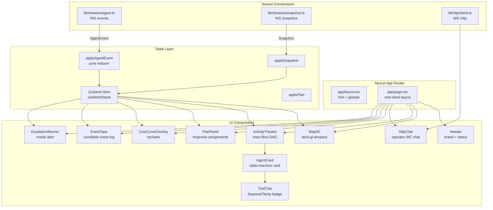
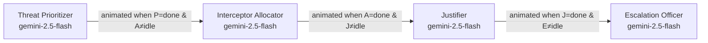
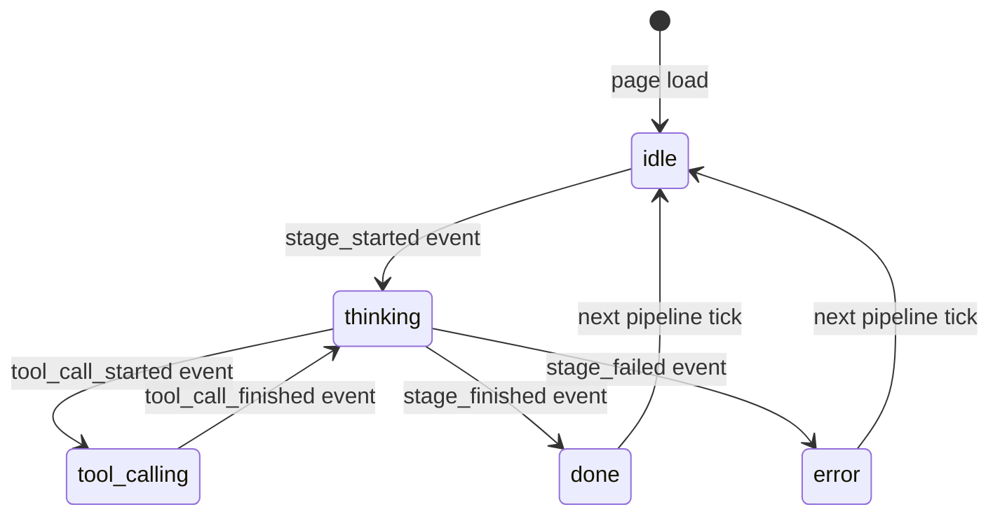
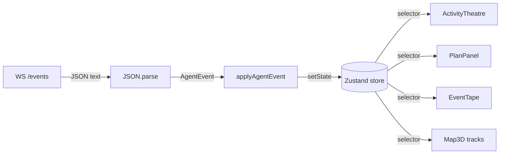

# Console

**Port:** `:3000`  
**Stack:** Next.js 15 (App Router), React 18, TypeScript, Tailwind CSS, Framer Motion, react-flow, deck.gl, recharts, Zustand  
**Path:** `apps/console/`

The Console is the operator interface for MeshShield. It combines a live 3D airspace map, an animated AG2 pipeline DAG (Activity Theatre), natural-language operator chat over NLIP, a response plan panel, a cost-curve overlay, and a scrollable event tape — all driven by a single Zustand event-sourced store.

---

## Component Architecture



---

## Activity Theatre

The Activity Theatre (`components/ActivityTheatre.tsx`) is the centerpiece of the console. It renders the four pipeline agents as nodes in a react-flow DAG, with animated edges that light up when a handoff completes.



Each node is rendered as an `AgentCard`. The `animated` prop on each react-flow edge is derived from the Zustand store:

```typescript
const edges = PIPELINE.slice(0, -1).map((a, i) => ({
  id: `${a.name}->${PIPELINE[i+1].name}`,
  source: a.name,
  target: PIPELINE[i+1].name,
  animated: agents[a.name].state === "done"
          && agents[PIPELINE[i+1].name].state !== "idle",
}));
```

---

## Agent Card State Machine

Each `AgentCard` component reflects the card's `AgentState` with Framer Motion animations:



Visual indicators per state:

| State | Ring color | Animation |
|---|---|---|
| `idle` | `ring-white/10` (dim) | none |
| `thinking` | `ring-accent` | `animate-pulse` |
| `tool_calling` | `ring-emerald-400` | ToolChip slides in |
| `done` | `ring-emerald-500/60` | none |
| `error` | `ring-danger` | shake `x: [0,-3,3,-2,2,0]` |

`ToolChip` components slide into the card using `AnimatePresence` + `motion.div layout`. Each chip shows the tool name (`simulate_intercept_path`, `tavily_recent_threats`), its state (`running`/`done`/`error`), and elapsed milliseconds.

---

## Zustand Event-Sourced Design

The entire console state is event-sourced. A single pure function `applyAgentEvent(ev: AgentEvent)` is the store's reducer:

```typescript
// lib/store/index.ts
export function applyAgentEvent(ev: AgentEvent): void {
  useMeshStore.setState((s) => {
    const tape = [...s.tape, ev].slice(-500);
    const agents = { ...s.agents };
    let plan = s.plan;

    switch (ev.kind) {
      case "stage_started":   updateAgent(ev.agent, { state: "thinking" }); break;
      case "stage_finished":  updateAgent(ev.agent, { state: "done", ... }); break;
      case "tool_call_started": updateAgent(ev.agent, { state: "tool_calling", ... }); break;
      case "plan_ready":      plan = ev.plan; break;
      // ...
    }
    return { ...s, tape, agents, plan };
  });
}
```

This design means:
- **Replay is free:** feed any saved event stream into `applyAgentEvent` and the UI reconstructs exactly.
- **E2E tests are trivial:** Playwright stubs emit the same event stream; no live services needed.
- **Time-travel debugging:** the event tape in the UI is the actual event stream — clicking an event shows what the store looked like at that moment.



---

## WebSocket Streams

| Stream | File | Protocol | Source |
|---|---|---|---|
| `WS /events` | `lib/streams/agent.ts` | JSON text | Agent :8002 |
| `WS /snapshot` | `lib/streams/snapshot.ts` | JSON text | Fusion :8001 |
| `WS /nlip` | `lib/nlip/client.ts` | CBOR or JSON | Agent :8002 (NLIP) |

Both `agent.ts` and `snapshot.ts` implement exponential backoff reconnect (500 ms → 5 s max). The NLIP client detects server capabilities via `GET /nlip/capabilities` and chooses binary (CBOR) or text frames accordingly.

---

## NLIP Chat Component

`NlipChat` renders the Watch Commander conversation panel. It uses the ECMA-432 WebSocket binding (auto-detected: CBOR if supported, JSON otherwise). Citation references in the Watch Commander's response are highlighted as inline chips using a regex:

```typescript
const CITATION = /\[(snapshot\.(?:[^\[\]]+|\[\d+\])+|clause:[^\]]+|plan-\w+)\]/g;
```

This turns `[snapshot.tracks[3].pos_3d]` and `[clause:auto_action_min_conf]` into styled chip spans inline in the message text.

---

## Map3D Component

`Map3D` uses **deck.gl** + **react-map-gl/MapLibre** to render:

- `ScatterplotLayer` — one dot per track, colored by `conf` (high confidence = white, low = dim)
- `GeoJsonLayer` — OSM-sourced asset polygon from `packages/scenarios/assets/osm-datacenter.geojson` rendered in red/orange

The map subscribes to `useMeshStore(s => s.tracks)` and re-renders at 10 Hz as snapshots stream in.

---

## Cost-Curve Overlay

`CostCurveOverlay` renders a recharts `LineChart` with two series:

- **Attacker cost** — linear: `n * $500` (FPV drone)
- **Defender cost** — flat: fixed infrastructure regardless of swarm size

The crossover point (where traditional defense becomes economically untenable) is annotated with a reference line.

---

## E2E Testing with Playwright

The E2E suite (`e2e/scenario.spec.ts`) uses a fake backend fixture (`e2e/fixtures/fake-fusion-and-agent.mjs`) that:
1. Starts a minimal WebSocket server emitting the same `AgentEvent` stream that the real agent service emits
2. Serves static snapshot payloads at the expected URLs
3. Navigates Playwright to `localhost:3000` and asserts UI states

Because the console is fully event-sourced, the fixture only needs to replay a pre-recorded event sequence — no LLM or Daytona calls required.

---

## How to Run

```bash
# From repo root
pnpm --filter @meshshield/console dev

# Or via Make
make dev   # all three services
```

---

## Tests

```bash
# Unit + component tests
pnpm --filter @meshshield/console exec vitest run

# E2E (requires running services or fake fixture)
pnpm --filter @meshshield/console exec playwright test
```

| Test file | What it covers |
|---|---|
| `tests/components/ActivityTheatre.test.tsx` | DAG renders 4 nodes |
| `tests/components/AgentCard.test.tsx` | State ring classes + tool chip presence |
| `tests/components/CostCurveOverlay.test.tsx` | Chart renders |
| `tests/components/EventTape.test.tsx` | Event list rendering |
| `tests/components/Header.test.tsx` | Brand + AG2 chip |
| `tests/components/Map3D.test.tsx` | Mock deck.gl + MapLibre mount |
| `tests/components/NlipChat.test.tsx` | Input, send, citation rendering |
| `tests/components/PlanPanel.test.tsx` | Assignment list rendering |
| `tests/components/page.test.tsx` | Root page smoke |
| `tests/store.test.ts` | `applyAgentEvent` reducer for all event kinds |
| `tests/streams.test.ts` | WebSocket stream reconnect logic |
| `tests/nlip.test.ts` | NLIP client CBOR/JSON frame handling |
| `tests/smoke.test.ts` | Import smoke |
| `e2e/scenario.spec.ts` | Full pipeline E2E with fake backend |
