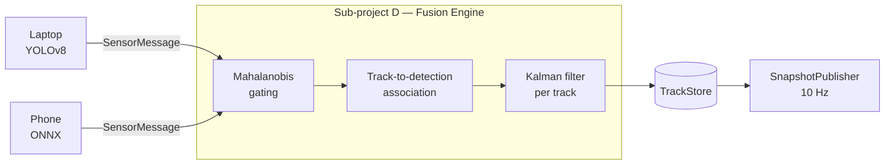

# Fusion Service

**Port:** `:8001`  
**Stack:** Python 3.12, FastAPI, uvicorn  
**Path:** `apps/fusion/`

The Fusion service owns airspace state. In this demo-scale slice (sub-projects A+F) it replays a pre-baked scenario JSON and broadcasts `Snapshot` objects at 10 Hz. In production (sub-project D) this service is replaced by real Kalman-filter-based multi-sensor fusion.

---

## Purpose

```
Scenario JSON  ──►  ScenarioPlayer  ──►  TrackStore  ──►  SnapshotPublisher  ──►  WS /snapshot
                                                                               ──►  WS /snapshot (console)
```

1. `ScenarioPlayer` reads the scenario file, advances simulation time, and upserts tracks into `TrackStore`.
2. `SnapshotPublisher` ticks at 10 Hz, calls `player.advance_to(t)`, serializes the store, and fans out JSON to all WebSocket subscribers.
3. The `/sensor` WebSocket accepts inbound `SensorMessage` frames (sub-projects B/C) but discards them in v1 — the interface is designed in, the behavior is not.

---

## Files

| File | Description |
|---|---|
| `src/fusion/main.py` | FastAPI app factory + lifespan (wires store, player, publisher) |
| `src/fusion/server.py` | Route definitions: `GET /health`, `WS /sensor`, `WS /snapshot` |
| `src/fusion/store.py` | `TrackStore` — dict-based in-memory track store, serializes to `Snapshot` Pydantic model |
| `src/fusion/scenario_player.py` | `ScenarioPlayer` — advances simulation time, spawns tracks, integrates positions |
| `src/fusion/snapshot_publisher.py` | `SnapshotPublisher` — 10 Hz async loop, fan-out sink pattern |

---

## Schemas

All schemas live in `packages/protocol/schemas/` and are generated into `packages/protocol/python/`.

**`Snapshot`** — the canonical output of one publisher tick:
```json
{
  "v": 1,
  "snapshot_id": "snap-00042",
  "ts": 1714680000.250,
  "tracks": [
    {
      "id": "t-001",
      "origin": "real",
      "pos_3d": [120.4, 88.1, 35.0],
      "vel": [12.0, -3.2, 0.5],
      "conf": 0.88,
      "nearest_asset_m": 47.2
    }
  ]
}
```

**`SensorMessage`** — accepted on `/sensor` (no-op in v1):
```json
{
  "v": 1,
  "node_id": "laptop-01",
  "ts": 1714680000.123,
  "detections": [
    { "class": "drone", "conf": 0.91, "bearing_deg": 142.5, "elev_deg": 8.3, "px_box": [320,180,80,60] }
  ]
}
```

---

## Scenario File Format

Scenarios live in `packages/scenarios/*.json`. The `data-center-swarm-attack.json` scenario:

```json
{
  "v": 1,
  "scenario_id": "data-center-swarm-attack",
  "duration_s": 30,
  "asset": { "asset_id": "datacenter-A", "center_xyz": [0, 0, 0], "radius_m": 60.0 },
  "interceptors": [...],
  "events": [
    { "t": 0,    "spawn": { "id": "t-001", "origin": "real", "pos_3d": [120,88,35], "vel": [-8,0,0], "conf": 0.91 } },
    { "t": 5,    "burst": { "id_prefix": "t-9", "count": 8, "ring_radius_m": 180, "altitude_m": 40, "speed_m_s": 12 } }
  ]
}
```

`ScenarioPlayer` supports two event types:
- **`spawn`** — single track with explicit state
- **`burst`** — radially symmetric swarm spawned in a ring, converging inward

---

## How to Run

```bash
# From repo root
uv run --directory apps/fusion uvicorn fusion.main:app --port 8001 --reload

# Or via Make
make dev   # starts all three services
```

Environment variables:
- `SCENARIO` — scenario filename without `.json` (default: `data-center-swarm-attack`)

---

## Tests

```bash
uv run pytest apps/fusion/tests/ -v
```

| Test file | What it covers |
|---|---|
| `test_store.py` | TrackStore upsert, snapshot serialization |
| `test_scenario_player.py` | Spawn + burst events, position integration |
| `test_snapshot_publisher.py` | 10 Hz tick, sink fan-out |
| `test_server_shell.py` | `/health` route |
| `test_server_snapshot_ws.py` | WebSocket `/snapshot` subscribe/receive |

---

## Future: Real Kalman Fusion (Sub-project D)

In sub-project D the `ScenarioPlayer` is replaced by a true fusion engine:



The `TrackStore` and `SnapshotPublisher` interfaces are unchanged. The swap is bounded to `scenario_player.py` → `fusion_engine.py`.

Design notes for sub-project D:
- Mahalanobis distance for gate test (chi-squared threshold)
- Constant-velocity Kalman model per track (6-state: x,y,z,vx,vy,vz)
- Track birth/death hysteresis (N/M confirmation, M-of-N deletion)
- `origin` field on `Track` distinguishes `"real"` (sensor-fused) from `"simulated"` (scenario injected for testing)
