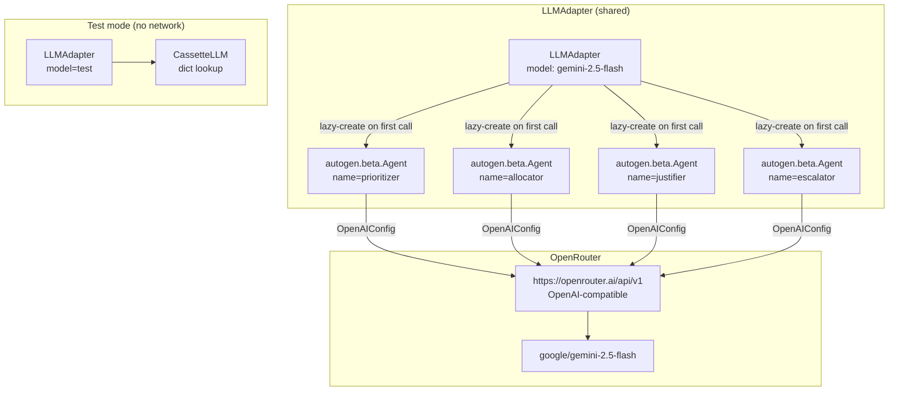

# AG2 Deep-Dive

How MeshShield uses [AG2](https://github.com/ag2ai/ag2) (`autogen.beta`) for multi-agent reasoning.

**AG2 docs:** https://github.com/ag2ai/ag2  
**OpenRouter docs:** https://openrouter.ai/docs

---

## What AG2 Is (and What We Use)

AG2 is a multi-agent orchestration framework for LLM-powered applications. It provides:
- `autogen.beta.Agent` — a conversational agent that maintains multi-turn state and calls an LLM via a provider config
- `autogen.beta.config.OpenAIConfig` — an OpenAI-compatible configuration object (works with any OpenAI-compatible endpoint, including OpenRouter)
- Async `await agent.ask(prompt)` API returning a reply object with `.body: str`

MeshShield uses AG2 for **five agents**: Prioritizer, Allocator, Justifier, Escalator (pipeline), and Watch Commander (NLIP). Each is an independently-named `autogen.beta.Agent` instance backed by the same `OpenAIConfig`.

We do **not** use AG2's multi-agent communication primitives (GroupChat, etc.) — our pipeline is sequential and explicitly orchestrated by `pipeline.py`. This is intentional: explicit orchestration is easier to reason about, debug, and test than implicit group conversations.

---

## The `LLMAdapter` Wrapper

**File:** `apps/agent/src/agent/llm/ag2_adapter.py`

`LLMAdapter` is a thin wrapper around AG2 that adds:
1. **Lazy initialization** — AG2 is imported only when `OPENROUTER_API_KEY` is available
2. **Stub mode** — if no API key, returns `"(stub: OPENROUTER_API_KEY not set)"` instead of failing
3. **JSON extraction** — `ask_json()` tolerates fenced code blocks and stray prose
4. **Lifecycle callbacks** — optional `on_lifecycle(kind, agent_name)` for test hooks

```python
class LLMAdapter:
    def __init__(self, model: str, llm=None, api_key=None, on_lifecycle=None):
        # llm: inject CassetteLLM for tests; None → construct _AG2LLM lazily
        self._llm = llm if llm is not None else _AG2LLM(model=model, api_key=api_key)
        self._on = on_lifecycle or (lambda kind, agent: None)
        self.model = model

    async def ask(self, agent_name: str, prompt: str) -> str:
        self._on("started", agent_name)
        text = await self._llm.ask(agent_name, prompt)
        self._on("finished", agent_name)
        return text

    async def ask_json(self, agent_name: str, prompt: str) -> dict:
        text = await self.ask(agent_name, prompt)
        s, e = text.find("{"), text.rfind("}")
        if s == -1 or e == -1:
            raise ValueError(f"no JSON in agent output: {text!r}")
        return json.loads(text[s:e+1])
```

### Why `ask_json` strips to the first `{...}` block

Gemini 2.5 Flash sometimes wraps JSON in a markdown code fence:
````
```json
{"prioritized": [...]}
```
````

The `text.find("{")` / `text.rfind("}")` extraction handles this without regex or model-specific hacks. It also handles trailing prose after the JSON object.

---

## The `_AG2LLM` Inner Class

```python
class _AG2LLM:
    def __init__(self, model: str, api_key: str | None) -> None:
        self._model = model
        self._api_key = api_key
        self._cfg = None       # populated on first call
        self._Agent = None
        self._agents: dict[str, object] = {}
        self._stubbed = False

    def _ensure_loaded(self) -> None:
        """Called on first ask(). Imports autogen.beta here, not at module level."""
        if self._cfg is not None or self._stubbed:
            return
        key = self._api_key or os.environ.get("OPENROUTER_API_KEY")
        if not key:
            self._stubbed = True
            return
        from autogen.beta import Agent
        from autogen.beta.config import OpenAIConfig
        self._Agent = Agent
        self._cfg = OpenAIConfig(
            model=self._model,
            streaming=False,
            api_key=key,
            base_url="https://openrouter.ai/api/v1",
            max_completion_tokens=1024,
        )

    async def ask(self, name: str, prompt: str) -> str:
        self._ensure_loaded()
        if self._stubbed:
            return "(stub: OPENROUTER_API_KEY not set)"
        if name not in self._agents:
            self._agents[name] = self._Agent(config=self._cfg, name=name)
        reply = await self._agents[name].ask(prompt)
        return reply.body
```

Key points:
- **One agent per name** — `self._agents["prioritizer"]`, `self._agents["allocator"]`, etc. Each maintains its own AG2 conversation state across ticks.
- **`base_url="https://openrouter.ai/api/v1"`** — this is how we route AG2 to OpenRouter instead of direct OpenAI. OpenRouter's API is OpenAI-compatible, so `OpenAIConfig` works without modification.
- **`streaming=False`** — we wait for the full response before returning. Streaming would complicate the JSON extraction.
- **`max_completion_tokens=1024`** — sufficient for all four pipeline agents' structured JSON outputs.

---

## Agent Construction in `main.py`

All five agents are wired in `apps/agent/src/agent/main.py` during FastAPI lifespan:

```python
llm = LLMAdapter(model=os.getenv("AG2_MODEL_FAST", "google/gemini-2.5-flash"))

prioritizer = Prioritizer(llm)
allocator   = Allocator(llm, interceptors=list_int(), simulate=sim,
                        snapshot_provider=store.latest_snapshot)
justifier   = Justifier(llm, tavily=tavily,
                        snapshot_provider=store.latest_snapshot,
                        policy_provider=get_policy, region=...)
escalator   = Escalator(llm, policy_provider=get_policy,
                        snapshot_provider=store.latest_snapshot)

# Watch Commander gets a separate LLMAdapter with the Pro model
watch_commander = WatchCommander(
    LLMAdapter(model=os.getenv("AG2_MODEL_PRO", "google/gemini-2.5-pro")),
    store=store
)
```

The four pipeline agents share one `LLMAdapter` (and thus one `OpenAIConfig`). The Watch Commander gets its own because it uses a different model.

The `LLMAdapter._AG2LLM._agents` dict is keyed by `agent_name` — so even though all four pipeline agents share one `LLMAdapter`, each gets its own `autogen.beta.Agent` instance with independent conversation state.

---

## The Structured Output Contract

Every pipeline agent follows the same contract:

1. **System prompt preamble** — role declaration + domain framing
2. **Input description** — named context keys injected as `KEY:\n{json}`
3. **Output contract** — exact JSON keys, types, and enum values specified
4. **Termination instruction** — `"Output JSON only, no prose"`

### Example: Prioritizer

```python
SYSTEM = (
  "You are the MeshShield Threat Prioritizer. Given an airspace snapshot, return a JSON object "
  "with the exact key 'prioritized', a list of objects sorted by risk_score descending, each having "
  "keys target_id (string), risk_score (number 0-1), "
  "intent_estimate (string in approach_asset|loiter|withdraw|unknown), "
  "nearest_asset_m (number). Output JSON only, no prose."
)

def build_prompt(self, snapshot: dict) -> str:
    return f"{SYSTEM}\n\nSNAPSHOT:\n{json.dumps(snapshot, separators=(',', ':'))}"
```

The full snapshot is serialized inline with `separators=(',', ':')` (compact form) to minimize token count. At 15 tracks, the snapshot is ~300 tokens — well within Gemini 2.5 Flash's context window.

---

## The Cassette Test Pattern

**File:** `apps/agent/src/agent/llm/cassette.py`

```python
class CassetteLLM:
    def __init__(self, mapping: dict[str, str]) -> None:
        self._m = mapping

    async def ask(self, name: str, prompt: str) -> str:
        key = f"{name}:{prompt}"
        if key not in self._m:
            raise KeyError(f"cassette miss: {key!r}")
        return self._m[key]
```

Tests inject `CassetteLLM` via `LLMAdapter(model="test", llm=CassetteLLM({...}))`. The cassette mapping is `{f"{agent_name}:{full_prompt}": expected_response}`.

### Writing a Cassette Test

```python
@pytest.mark.asyncio
async def test_prioritizer_happy():
    snapshot = {"v":1, "snapshot_id":"s1", "ts":0.0, "tracks":[
        {"id":"t-001", "origin":"real", "pos_3d":[100,80,40],
         "vel":[-10,-8,0], "conf":0.92, "nearest_asset_m":120.0}
    ]}
    expected_response = json.dumps({"prioritized":[
        {"target_id":"t-001", "risk_score":0.91,
         "intent_estimate":"approach_asset", "nearest_asset_m":120.0}
    ]})
    p = Prioritizer.__new__(Prioritizer)  # skip __init__ for manual wiring
    p._llm = LLMAdapter("test", llm=CassetteLLM({
        f"prioritizer:{p.build_prompt(snapshot)}": expected_response
    }))
    out = await p.run(snapshot)
    assert out["prioritized"][0]["risk_score"] == 0.91
```

The cassette key is exactly `f"{agent_name}:{prompt}"`. If the system prompt changes, the cassette misses with a clear `KeyError` that names the missing key — no silent fallthrough.

### Pre-recorded Cassettes

`apps/agent/tests/cassettes/prioritizer.json` stores a real LLM response recorded from an actual OpenRouter call. This is used in tests that need a realistic response without mocking the entire expected output:

```python
with open("tests/cassettes/prioritizer.json") as f:
    cassette_data = json.load(f)
llm = LLMAdapter("test", llm=CassetteLLM(cassette_data))
```

---

## Agent Pipeline Flow Diagram (AG2 Perspective)



---

## Key Links

| Resource | URL |
|---|---|
| AG2 GitHub | https://github.com/ag2ai/ag2 |
| AG2 docs | https://docs.ag2.ai |
| OpenRouter API docs | https://openrouter.ai/docs |
| OpenRouter model list | https://openrouter.ai/models |
| Gemini 2.5 Flash (OpenRouter) | https://openrouter.ai/google/gemini-2.5-flash-preview |
| Gemini 2.5 Pro (OpenRouter) | https://openrouter.ai/google/gemini-2.5-pro-preview |
