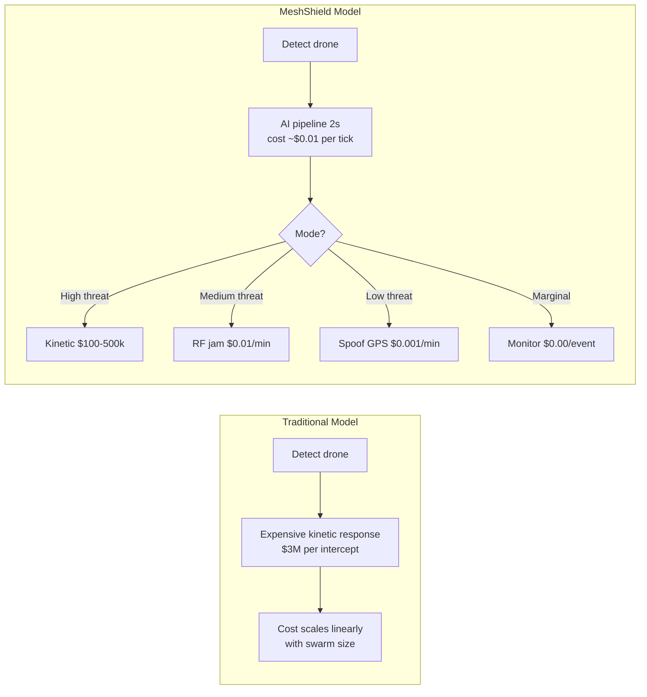
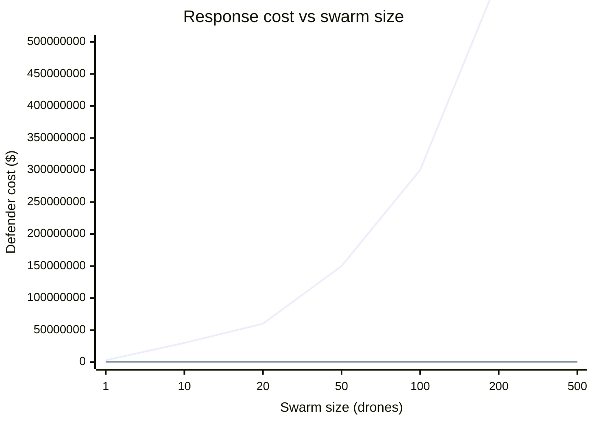
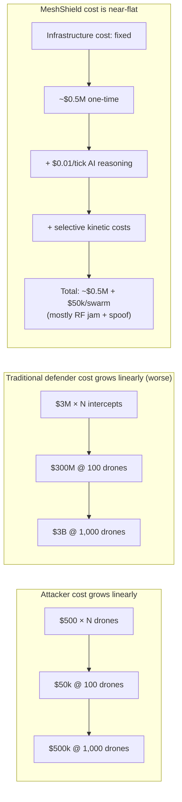
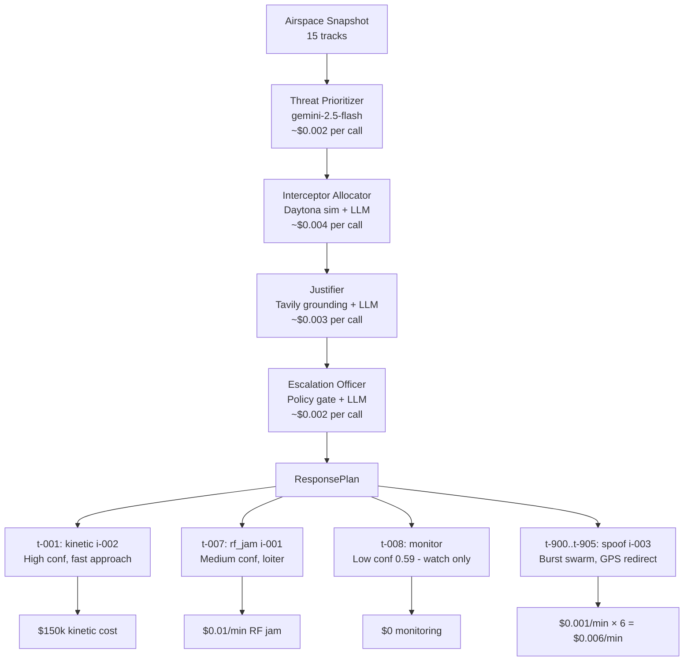

# The Cost Curve: Why Software-Defined Defense Wins

The core thesis of MeshShield in one sentence: **the marginal cost of reasoning about the 100th drone is zero once the intelligence infrastructure exists**.

---

## The Asymmetry Problem

| System | Unit cost | Intended target |
|---|---|---|
| Patriot PAC-3 interceptor missile | ~$3,000,000 | Ballistic missiles, aircraft |
| Commercial FPV drone (adversary) | ~$500 | Any soft target |
| 100-drone swarm (adversary total) | ~$50,000 | |

Against a Patriot battery, the math is catastrophic for the defender:

```
Defender cost to neutralize 100 drones: 100 × $3M = $300,000,000
Adversary cost to build 100 drones:                 $50,000
Cost ratio:                                         6,000×
```

This is the cost asymmetry that makes drone swarms an existential threat to traditional air defense. The adversary can iterate cheaply; the defender cannot.

---

## How Software-Defined Defense Flips the Curve

The MeshShield model decouples the **intelligence cost** (reasoning about threats) from the **kinetic cost** (responding to them).



Key points:
- **RF jamming** costs fractions of a cent per minute once the hardware is deployed
- **GPS spoofing** redirects drones without destroying them, at near-zero marginal cost
- **Kinetic response is reserved** for only the highest-threat tracks, guided by AI prioritization
- **The AI reasoning cost** (LLM inference via OpenRouter) is ~$0.01 per 2-second pipeline tick for a 15-track scenario — essentially zero at scale

---

## The Cost Curve



*(Mermaid xychart-beta — render in a GitHub/Mermaid-compatible viewer)*



The crossover point where traditional defense becomes economically untenable is approximately 5–10 drones per defended asset. MeshShield's curve stays flat by:

1. **Mode selection** — AI chooses the cheapest effective response for each target
2. **Priority gating** — only the highest-risk tracks get kinetic responses; others get RF or spoof
3. **Fixed infrastructure** — the AI reasoning cost doesn't scale with swarm size (it's ~constant per tick)

---

## MeshShield's Role in This Picture



**The AI layer** costs ~$0.011 per 2-second tick (at typical Gemini 2.5 Flash pricing via OpenRouter for a 15-track scenario). The response plan it produces saves potentially millions by directing cheaper countermeasures at lower-threat targets and reserving kinetics for only the highest-priority tracks.

**The ROI case:** Even if the AI saved 10% of kinetic responses on a 50-drone swarm (5 fewer $3M Patriot missiles), that's $15M saved per engagement. The entire MeshShield infrastructure (hardware + AI costs) is covered by a fraction of one engagement.

---

## The Demo Arc

At the demo, the cost-curve overlay in the console (`CostCurveOverlay` component, recharts) shows this story visually:
- **Attacker line** climbs linearly as swarm size grows
- **Defender line** stays flat once MeshShield infrastructure is in place
- The crossover point (where traditional defense fails economically) is annotated

The audience can see in real time: as the burst swarm fires at t=18s (6 new drones), the pipeline assigns 5 of them to RF jam / spoof (cheap) and 1 to kinetic (expensive, only for the highest-confidence track). The cost curve updates accordingly.

This is the product narrative: **not just automation, but cost-optimal automation**.
