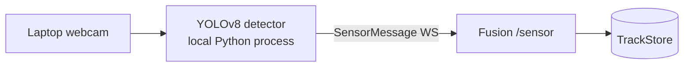
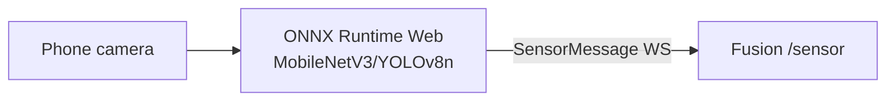
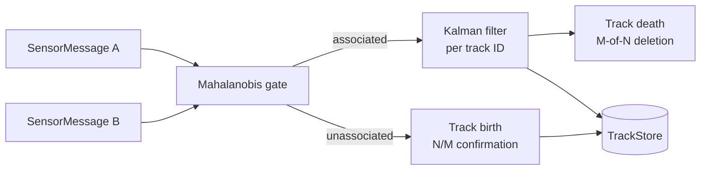
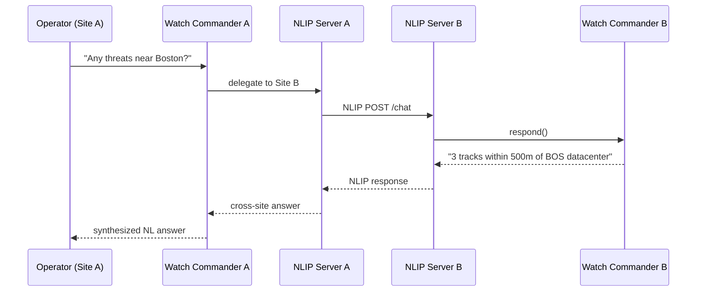

# Roadmap

What comes after the AG2 Hackathon demo. Sub-projects are labeled to match the original spec's A+F baseline nomenclature.

---

## Current State (Sub-projects A+F — Completed)

The `feat/skeleton-and-agent` branch delivers:

- Fusion service with scenario player and 10 Hz publisher
- Agent service with four-stage AG2 pipeline + Watch Commander + NLIP
- Next.js 15 console with all panels
- JSON Schema codegen, 52 Python tests, 20 TS tests, 2 E2E specs

---

## Near-term: Real Sensors and Better Fusion

### Sub-project B — Laptop Webcam Sensor Node

**Goal:** Turn any laptop with a webcam into a sensor node that feeds `SensorMessage` frames to the Fusion `/sensor` WebSocket.



**Deliverables:**
- `apps/sensor-laptop/` — Python app using `ultralytics` YOLOv8
- Bearing and elevation estimation from bounding box + camera intrinsics
- `origin: "real"` tracks from sensor-detected objects

**Estimated effort:** 1–2 days

### Sub-project C — Phone Browser Sensor Node

**Goal:** Turn any phone into a sensor node using ONNX Runtime Web (no install required — just open a URL).



**Deliverables:**
- `apps/sensor-phone/` — Next.js page with WebRTC camera access + ONNX Runtime Web
- Model quantized to INT8 (~3 MB) for mobile inference
- WebSocket client that sends `SensorMessage` frames

**Estimated effort:** 2–3 days

### Sub-project D — Real Kalman Fusion

**Goal:** Replace `ScenarioPlayer` with a true multi-sensor fusion engine.



**Algorithm:**
- Constant-velocity 6-state Kalman model: `[x, y, z, vx, vy, vz]`
- Mahalanobis distance gate (chi-squared threshold) for detection → track association
- Track birth on N=2/M=3 confirmations; track death on M=3/N=5 misses
- `origin: "real"` for sensor-fused tracks

**Estimated effort:** 3–5 days (the math is well-specified; implementation is straightforward)

---

## Medium-term: Scale and Persistence

### Sub-project E — 1000-Track Live Spawn UI

**Goal:** UI controls for spawning/deleting tracks in real time; stress-test the pipeline at 1000+ tracks.

**Deliverables:**
- `apps/console/components/SpawnControls.tsx` — slider for swarm size, burst pattern picker
- Fusion API endpoint `POST /spawn` to inject tracks programmatically
- Agent pipeline stress test at 500/1000/2000 tracks

**Open questions:** Can Gemini 2.5 Flash handle a 1000-track snapshot in its context window? May need to pre-summarize at high track counts.

### Persistence Layer

**Goal:** Persist snapshots, plans, and events for historical analysis.

```mermaid
flowchart LR
  BUS[EventBus] -->|append| REDIS[Redis hot state<br/>last 10 min]
  BUS -->|async write| PG[Postgres + pgvector<br/>full history]
  PG -->|similarity search| API[Search API<br/>"find similar incidents"]
```

**Deliverables:**
- `apps/agent/src/agent/persistence/` — async writers for Redis + Postgres
- `packages/protocol/schemas/incident.schema.json` — incident report type
- pgvector embedding of `plan.assignments` for similarity search ("find past incidents like this")

### Hardening

| Item | Description |
|---|---|
| TLS everywhere | Self-signed certs via `mkcert` for local dev; Let's Encrypt in staging |
| OAuth2 / API key auth | Protect `/events`, `/nlip`, and Fusion `/sensor` |
| Rate limiting | Prevent NLIP spam from burning OpenRouter credits |
| OpenTelemetry traces | Instrument pipeline stages with OTEL spans; export to Jaeger |
| Circuit breaker | Wrap Tavily and Daytona calls with `tenacity` for retry + backoff |

---

## Long-term: Federation and Real Actuators

### NLIP Federation

**Goal:** Two MeshShield instances (Site A + Site B) coordinate in real time using NLIP.



No custom protocol work needed — both sites already speak ECMA-430.

### Real Interceptor API

**Goal:** Replace `simulate_intercept_path` with a real actuator command.

The current shim returns simulation data. A production actuator would:
1. Accept `{target_id, interceptor_id, mode}` commands
2. Translate to platform-specific actuator commands (RF jammer control, drone dispatch)
3. Return telemetry (intercept acknowledged, in-flight, success/failure)

The `mode: "rf_jam" | "kinetic" | "spoof" | "monitor"` enum is already in the JSON Schema — the actuator binding is a drop-in replacement for the Daytona shim.

### Multi-Model Strategy

Currently all four pipeline agents share a single `LLMAdapter` (same model). Future work:
- Fine-tuned threat classification model for the Prioritizer (open-source, deployable on-prem)
- Smaller on-device model (Gemma 2B) for Prioritizer in air-gapped environments
- Gemini Pro for Justifier when citation quality matters most

---

## Sub-project Summary

| Sub-project | Priority | Effort | Dependencies |
|---|---|---|---|
| B — Laptop webcam | High | 1–2 days | YOLOv8, camera access |
| C — Phone browser sensor | High | 2–3 days | ONNX Runtime Web, WebRTC |
| D — Kalman fusion | High | 3–5 days | NumPy, scipy |
| E — Live spawn UI | Medium | 1–2 days | None |
| Persistence | Medium | 3–4 days | Redis, Postgres, pgvector |
| NLIP federation | Low | 1–2 days | Second MeshShield instance |
| Real interceptors | Low (hardware) | TBD | Actuator hardware/API |
| Hardening | Low (for demo) | 4–6 days | mkcert, OTEL, tenacity |
