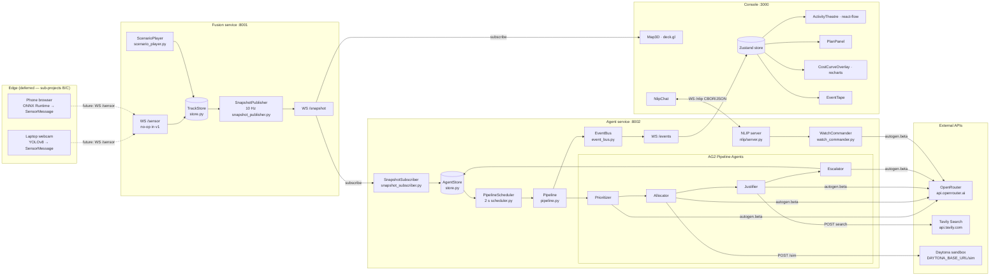
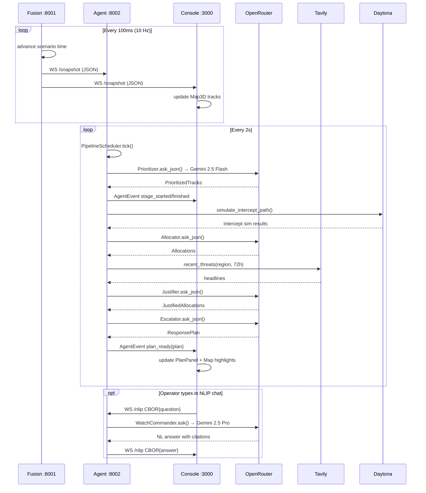

# 01 — System Overview

MeshShield is a software-defined counter-swarm drone defense platform. This document describes the full system architecture at the service level, explains the rationale for each design decision, and maps components to source files.

---

## System Diagram

---

## Service Responsibilities

### Fusion Service `:8001`

| Responsibility | How |
|---|---|
| Airspace state | `TrackStore` — dict keyed by track ID, updated via `upsert()` |
| Track simulation | `ScenarioPlayer` — reads JSON events, integrates positions at each tick |
| Publishing | `SnapshotPublisher` — 10 Hz async loop, fanout via sink callbacks |
| Sensor input (future) | `WS /sensor` — accepts `SensorMessage` frames, no-op in v1 |

The Fusion service is **stateless with respect to agent reasoning** — it only knows about physical tracks. It does not know about agents, plans, or NLIP. This separation means the agent service can be restarted independently without losing airspace continuity.

### Agent Service `:8002`

| Responsibility | How |
|---|---|
| Snapshot ingestion | `SnapshotSubscriber` — async WS client to Fusion `/snapshot` |
| State ring buffer | `AgentStore` — holds latest snapshot, latest plan, ring-200 event deque |
| Pipeline scheduling | `PipelineScheduler` — fires `Pipeline.run_tick(snapshot)` every 2 s |
| Reasoning | AG2 pipeline — four sequential agents, each a structured-output LLM call |
| Event broadcast | `EventBus` — fan-out to N WebSocket subscribers + `AgentStore` |
| Operator chat | `WatchCommander` + NLIP server — 5th agent, ECMA-430 protocol |

The agent service **never writes to Fusion** — it is a pure subscriber+thinker. This makes it independently scalable: multiple agent services can subscribe to the same Fusion instance for redundancy.

### Console `:3000`

| Responsibility | How |
|---|---|
| Live map | `Map3D` — subscribes to Fusion WS directly; deck.gl render |
| Pipeline visualization | `ActivityTheatre` — react-flow DAG driven by Zustand agent states |
| Operator chat | `NlipChat` — WS to Agent `/nlip` |
| Plan display | `PlanPanel` — reads `useMeshStore(s => s.plan)` |
| Event audit | `EventTape` — scrollable event list from `useMeshStore(s => s.tape)` |
| Cost narrative | `CostCurveOverlay` — recharts visualization of cost asymmetry |

The console is **read-only** relative to the backend — it only subscribes, never writes (NLIP chat is the only exception).

---

## Design Rationale

### Why three separate services?

Each service has a distinct scaling profile:
- **Fusion** scales with sensor count (future: multiple real-time feeds)
- **Agent** scales with reasoning load (future: multiple regions)
- **Console** scales with operator count (future: multiple roles)

Separation also means clean failure domains: if the Agent service crashes, Fusion keeps tracking and the Console keeps showing the airspace. When Agent restarts, it reconnects to Fusion and resumes from the current snapshot.

### Why WebSocket over REST for hot paths?

The Fusion → Agent and Fusion → Console paths are 10 Hz publish/subscribe. HTTP polling at 10 Hz would be wasteful and latency-adding. WebSocket with fanout sinks gives sub-10 ms delivery with no per-message overhead after handshake.

The Agent → Console path is event-driven (not a fixed rate) — the EventBus pushes immediately on every stage transition. REST polling would add 100–500 ms latency and obscure the event causality that the UI relies on.

### Why event-sourced UI?

The Zustand store's `applyAgentEvent` is a pure reducer: `(state, event) => newState`. This has three consequences:

1. **Replay** — save the event tape, feed it back in, get exactly the same visual state. Used by Playwright E2E.
2. **Audit** — the EventTape in the UI is the actual event stream. Nothing is lost.
3. **Testability** — unit tests call `applyAgentEvent` directly; no component mount required for logic tests.

### Why AG2 for agents?

AG2's `autogen.beta.Agent` provides per-agent conversation state (multi-turn if needed), structured LLM calling via `OpenAIConfig`, and clean async `await agent.ask(prompt)` semantics. For this system's sequential pipeline pattern, AG2's conversational state is a bonus — each agent remembers context across ticks without explicit plumbing.

The lazy-import pattern (`from autogen.beta import Agent` inside `_ensure_loaded`) means the entire test suite runs without installing AG2's LLM backends — just `CassetteLLM` is needed.

### Why OpenRouter instead of direct GCP?

OpenRouter provides a unified OpenAI-compatible endpoint for 200+ models including Gemini 2.5 Flash and Pro. Using it means:
- One API key (`OPENROUTER_API_KEY`) for all LLM calls
- No GCP project, billing account, or quota provisioning needed for the hackathon
- Easy model swaps via `AG2_MODEL_FAST` / `AG2_MODEL_PRO` env vars

### Why NLIP for operator chat?

NLIP (Ecma-430/431/432) is a standardized wire protocol for natural-language agent communication. Using it at the operator chat boundary means:
- The MeshShield Watch Commander is discoverable and interoperable with any NLIP-compatible client
- Future federation (two MeshShield instances coordinating) uses the same protocol as the operator chat
- The protocol is transport-agnostic: HTTP (ECMA-431) for stateless queries, WebSocket+CBOR (ECMA-432) for low-latency chat

See [docs/architecture/03-nlip-integration.md](03-nlip-integration.md) for the full NLIP deep-dive.

---

## Port Map

| Service | Port | Endpoints |
|---|---|---|
| Fusion | `:8001` | `GET /health`, `WS /sensor`, `WS /snapshot` |
| Agent | `:8002` | `GET /health`, `WS /events`, `GET /nlip/capabilities`, `POST /nlip/chat`, `WS /nlip` |
| Console | `:3000` | `GET /` (Next.js SSR/CSR) |

---

## Data Flow Summary

