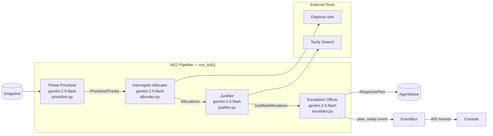

# 02 — Agent Pipeline

The MeshShield agent pipeline is a four-stage sequential reasoning chain implemented with [AG2](https://github.com/ag2ai/ag2) (`autogen.beta`). Each stage is a separate `autogen.beta.Agent` instance, each with its own system prompt and structured-output contract. The pipeline runs every 2 seconds against the latest airspace snapshot.

---

## Pipeline Overview



---

## Stage 1: Threat Prioritizer

**File:** `apps/agent/src/agent/agents/prioritizer.py`

The Prioritizer receives the raw snapshot (all tracks) and returns them sorted by `risk_score` descending.

**Input:** `Snapshot` dict

**Output:**
```json
{
  "prioritized": [
    { "target_id": "t-001", "risk_score": 0.91, "intent_estimate": "approach_asset", "nearest_asset_m": 47.2 },
    { "target_id": "t-007", "risk_score": 0.73, "intent_estimate": "approach_asset", "nearest_asset_m": 120.0 }
  ]
}
```

**System prompt contract:**
```
You are the MeshShield Threat Prioritizer. Given an airspace snapshot, return a JSON object
with the exact key 'prioritized', a list of objects sorted by risk_score descending, each having
keys target_id (string), risk_score (number 0-1), intent_estimate (string in
approach_asset|loiter|withdraw|unknown), nearest_asset_m (number). Output JSON only, no prose.
```

**Why no external tools here?** The Prioritizer works on raw sensor geometry (position, velocity, confidence). No external context is needed — this is pure spatial reasoning. Adding a tool call here would add latency with no benefit.

---

## Stage 2: Interceptor Allocator

**File:** `apps/agent/src/agent/agents/allocator.py`

The Allocator matches each high-priority target to an available interceptor. Before calling the LLM, it **pre-computes simulation results** for every `(target, interceptor)` pair and injects them into the prompt. The LLM then chooses assignments based on simulation quality, not raw geometry.

**Input:** `PrioritizedTracks` from Prioritizer

**Pre-computation (before LLM call):**
```python
for row in prioritized["prioritized"]:
    tid = row["target_id"]
    for itc in self._interceptors:
        r = self._sim(track, itc)   # Daytona or local fallback
        sim_results[tid].append({
            "interceptor_id": itc["id"],
            "intercept_ts": r["intercept_ts"],      # time-to-intercept in seconds
            "miss_distance_m": r["miss_distance_m"],
            "source": r.get("source", "local-fallback")
        })
```

**Output:**
```json
{
  "allocations": [
    { "target_id": "t-001", "interceptor_id": "i-002", "mode": "kinetic", "priority": 1 }
  ],
  "_sim_sources": { "t-001": ["daytona"], "t-007": ["local-fallback"] }
}
```

The `_sim_sources` field is added by the Allocator (not the LLM) — it surfaces which targets had Daytona-backed simulation vs local fallback. The console renders this as a badge on the AgentCard.

### Daytona Integration

```mermaid
flowchart LR
  SIM[simulate_intercept_path] -->|DAYTONA_BASE_URL set?| CHECK{check}
  CHECK -->|yes| DAYT[POST DAYTONA_BASE_URL/sim<br/>timeout 1.5s]
  CHECK -->|no| LOCAL[local numpy approximation]
  DAYT -->|success| RESULT[{intercept_ts, miss_distance_m, energy_j, source:daytona}]
  DAYT -->|timeout or error| LOCAL
  LOCAL --> RESULT2[{intercept_ts, miss_distance_m, energy_j, source:local-fallback}]
```

The local fallback (`_local_sim`) uses a closing-speed approximation:
1. Compute initial distance from interceptor to target
2. Compute closing speed = interceptor max speed − target speed
3. `intercept_ts = distance / closing_speed`

This is not ballistically accurate but is sufficient for the demo-scale prioritization task. The Daytona shim would run a proper 6-DOF simulation in production.

---

## Stage 3: Justifier

**File:** `apps/agent/src/agent/agents/justifier.py`

The Justifier annotates each allocation with a structured citation trace. Its output is the only place in the pipeline where external evidence (news headlines) is explicitly surfaced.

**Input:** `Allocations` from Allocator

**Tavily Integration:**
```python
async def run(self, allocations: dict) -> dict:
    try:
        headlines = self._tavily(self._region, 72)   # cached 1h per (region, bucket)
    except Exception:
        headlines = []
    # inject headlines into LLM prompt
    out = await self._llm.ask_json("justifier", self.build_prompt(allocations, headlines))
```

The Tavily tool is a factory function with a 1-hour `(region, hour_bucket)` cache:
```python
def _bucket(t: float) -> int:
    return int(t // 3600)   # new bucket each hour

cache: dict[tuple[str, int, int], list[dict]] = {}
key = (region, hours, _bucket(now()))
if key in cache:
    return cache[key]
# else call Tavily API...
```

**Output:**
```json
{
  "justified": [
    {
      "target_id": "t-001",
      "interceptor_id": "i-002",
      "mode": "kinetic",
      "priority": 1,
      "justification": {
        "snapshot_refs": ["tracks[0].pos_3d", "tracks[0].conf"],
        "tavily_refs": ["headline: FPV drone swarms reported near data centers"],
        "policy_refs": ["clause:auto_action_min_conf"]
      }
    }
  ]
}
```

**Why citations?** The justification trace serves two purposes:
1. **Audit** — operators can trace exactly why a kinetic response was chosen, down to specific snapshot fields and policy clauses
2. **Watch Commander context** — the WC agent sees these citations and can cite them back to the operator in NL

---

## Stage 4: Escalation Officer

**File:** `apps/agent/src/agent/agents/escalator.py`

The Escalation Officer validates the proposed assignments against policy and produces the final `ResponsePlan`. It is the only agent that also runs a **deterministic pre-check** (`_hint`) before calling the LLM.

### Deterministic Escalation Hint

```python
def _hint(self, justified: dict) -> dict:
    reasons: list[str] = []
    min_conf = float(policy.get("auto_action_min_conf", 0.7))
    for a in justified["justified"]:
        t = next(t for t in tracks if t["id"] == a["target_id"])
        if float(t["conf"]) < min_conf:
            reasons.append(f"track {tid} conf {t['conf']:.2f} < {min_conf}")
    nearby = sum(1 for t in tracks if float(t.get("nearest_asset_m", 1e9)) < 60.0)
    if nearby > policy["escalate_if_tracks_per_asset_gt"]:
        reasons.append(f"{nearby} tracks within 60m of asset > threshold")
    return {"required": bool(reasons), "reasons": reasons}
```

This hint is injected into the LLM prompt as `ESCALATION_HINT`. The LLM must reflect it in the output — if the hint says escalation is required, the plan must say so too. This makes the escalation policy deterministic: the LLM cannot silently override a threshold breach.

**Output (ResponsePlan):**
```json
{
  "v": 1,
  "plan_id": "plan-a1b2c3d4",
  "snapshot_id": "snap-00042",
  "ts": 1714680002.8,
  "assignments": [
    {
      "target_id": "t-001",
      "interceptor_id": "i-002",
      "mode": "kinetic",
      "priority": 1,
      "justification": "High confidence approach vector; sim confirms <2s intercept window"
    }
  ],
  "escalation": {
    "required": false,
    "reasons": []
  }
}
```

---

## Pipeline Orchestration

**File:** `apps/agent/src/agent/pipeline.py`

The `Pipeline.run_tick()` method is the sequential runner. It wraps each stage in a `stage()` helper that emits lifecycle events to the EventBus:

```python
async def stage(name: str, coro_factory):
    self._bus.emit({"kind": "stage_started", "agent": name, "ts": time.time()})
    t0 = time.monotonic()
    try:
        result = await coro_factory()
        self._bus.emit({
            "kind": "stage_finished",
            "agent": name,
            "output_summary": _summarize(result),
            "ms": int((time.monotonic() - t0) * 1000),
            "ts": time.time()
        })
        return result
    except Exception as exc:
        self._bus.emit({"kind": "stage_failed", "agent": name, "error": str(exc), "ts": time.time()})
        raise

prioritized = await stage(self._p.name, lambda: self._p.run(snapshot))
allocated   = await stage(self._a.name, lambda: self._a.run(prioritized))
justified   = await stage(self._j.name, lambda: self._j.run(allocated))
plan        = await stage(self._e.name, lambda: self._e.run(justified))
```

If any stage fails (LLM error, schema parse error, network timeout), the exception propagates up to the `PipelineScheduler` which logs it and waits for the next tick. The AgentStore retains the last successful plan — the console never shows a blank state.

---

## Agent State Machine

Each agent emits events that drive the console's visual state machine:

```mermaid
stateDiagram-v2
  [*] --> idle : page load / new tick starts

  state "Active Tick" {
    idle --> thinking : stage_started
    thinking --> tool_calling : tool_call_started
    tool_calling --> thinking : tool_call_finished
    thinking --> done : stage_finished
    thinking --> error : stage_failed
    tool_calling --> error : stage_failed
  }

  done --> idle : next tick starts
  error --> idle : next tick starts
```

Tool call events are emitted by the tool wrappers in `apps/agent/src/agent/tools/`:

```python
# Allocator emits tool events around Daytona calls
self._bus.emit({"kind": "tool_call_started", "agent": "allocator",
                "tool": "simulate_intercept_path", "ts": time.time()})
# ... call Daytona ...
self._bus.emit({"kind": "tool_call_finished", "agent": "allocator",
                "tool": "simulate_intercept_path", "ms": elapsed_ms, "ts": time.time()})
```

---

## Scheduler

**File:** `apps/agent/src/agent/scheduler.py`

The `PipelineScheduler` is a simple `asyncio.sleep` loop:

```python
async def run(self) -> None:
    self._running = True
    while self._running:
        snap = self._get()           # latest from AgentStore
        if snap is not None:
            try:
                await self._pipe.run_tick(snap)
            except Exception:
                log.exception("pipeline tick failed; holding last-good plan")
        await asyncio.sleep(self._period)   # default 2.0s
```

If `run_tick` takes longer than `self._period`, the next tick fires immediately after completion (no back-pressure). If the pipeline consistently exceeds 5 seconds (the hard cap target), the operator sees a warning in logs — the console's EventTape will show `stage_failed` events.

---

## Prompt Engineering Notes

Each agent's system prompt follows a strict contract:

1. **Role declaration** — `"You are the MeshShield X..."` grounds the agent in its domain
2. **Input description** — names the context keys injected into the prompt (`SNAPSHOT:`, `ALLOCATIONS:`, etc.)
3. **Output contract** — exactly specifies the JSON keys, types, and enumerations
4. **Termination instruction** — `"Output JSON only, no prose"` prevents fenced code blocks (the adapter strips them anyway, but this reduces parse failures)

The system prompt is prepended to the user message (not sent as a separate system role) to maximize compatibility across models via OpenRouter.

---

## LLM Model Assignment

| Agent | Model | Rationale |
|---|---|---|
| Prioritizer | `gemini-2.5-flash` | Fast; task is structured scoring, not reasoning |
| Allocator | `gemini-2.5-flash` | Fast; receives pre-computed sim data, just needs to pick |
| Justifier | `gemini-2.5-flash` | Moderate; citation generation benefits from context window |
| Escalator | `gemini-2.5-flash` | Fast; deterministic hint handles the hard logic |
| Watch Commander | `gemini-2.5-pro` | Slower but smarter; NL quality matters for operator trust |

Models are configured via environment variables (`AG2_MODEL_FAST`, `AG2_MODEL_PRO`) and can be swapped without code changes.
