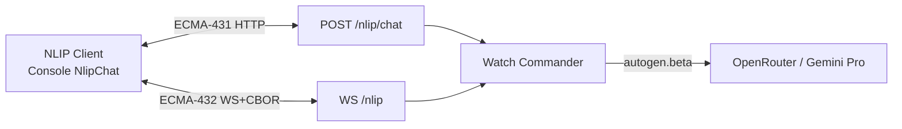
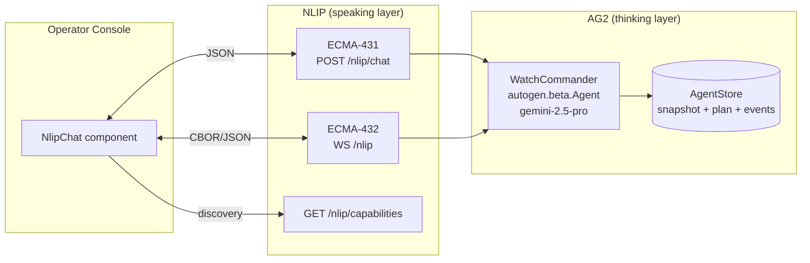
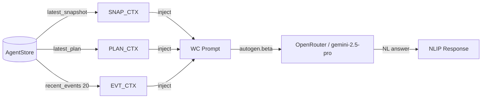
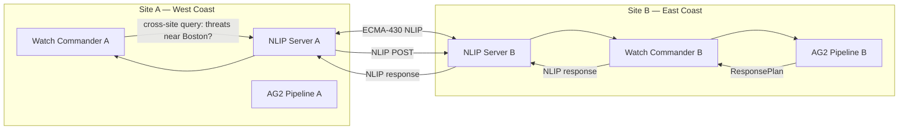

# 03 — NLIP Integration

NLIP (Natural Language Interaction Protocol, Ecma-430) is the wire protocol used by MeshShield for operator-facing natural-language communication. This document explains what NLIP is, why we use it, how it is implemented in MeshShield, and how it pairs with AG2.

---

## What is NLIP?

NLIP (Ecma-430) is a published ECMA standard for interoperable natural-language agent communication. It defines:

- A **message format** — `{format, subformat, content}` tuples where `format` is `"text"`, `"data"`, `"audio"`, etc.
- **Two transport bindings:**
  - **ECMA-431** — HTTP REST binding (`POST /nlip/chat`, `GET /nlip/capabilities`)
  - **ECMA-432** — WebSocket + CBOR binary binding (`WS /nlip`)
- A **capabilities discovery mechanism** — `GET /nlip/capabilities` returns what the agent can do

The key property of NLIP is **transport-agnostic interoperability**: any NLIP-compatible client can talk to any NLIP-compatible server without prior agreement on implementation. This is what makes federation (two MeshShield instances coordinating) possible without custom protocol work.



---

## Why NLIP at the Operator Chat Boundary?

### The Alternative

Without NLIP, the operator chat would be a custom `POST /chat` endpoint returning `{answer: string}`. This works for the demo but creates vendor lock-in at the operator boundary.

### The NLIP Advantage

Using NLIP at this boundary means:

1. **Discoverability** — any client that speaks NLIP can discover MeshShield's capabilities via `GET /nlip/capabilities` and start talking
2. **Interoperability** — the console's `NlipChat` component works against any NLIP-compliant backend, not just MeshShield
3. **Federation** — two MeshShield instances can act as NLIP peers: one's Watch Commander delegates to the other's pipeline using the standard coordinator-agent pattern from ECMA-430 Annex B
4. **Binary efficiency** — ECMA-432's CBOR framing is ~30% smaller than equivalent JSON for chat messages, important for low-bandwidth tactical networks

### NLIP is NOT an Agent Framework

NLIP is a **wire protocol**, not an agent orchestration framework. It says nothing about how the agent thinks, what model it uses, or how it structures its reasoning. This is why pairing NLIP with AG2 is the cleanest separation of concerns:

- **AG2** handles thinking: multi-turn conversation state, model routing, structured output
- **NLIP** handles speaking: the standardized wire format between the agent and the operator (or another agent)



---

## Implementation

**File:** `apps/agent/src/agent/nlip/server.py`

### Capabilities Endpoint

```python
CAPABILITIES = ["query_current_threats", "explain_decision", "summarize_situation"]

@router.get("/capabilities")
async def capabilities() -> dict:
    return {
        "name": "MeshShield Watch Commander",
        "protocol": "ECMA-430",
        "binding_http": "ECMA-431",
        "binding_ws":   "ECMA-432",
        "capabilities": CAPABILITIES
    }
```

### HTTP Binding (ECMA-431)

```python
@router.post("/chat")
async def chat(req: Request) -> dict:
    body = await req.json()
    # NLIP message format: {format, subformat, content}
    if body.get("format") != "text":
        return {"format": "text", "subformat": "english",
                "content": "Unsupported format; only 'text' is implemented."}
    question = body.get("content", "")
    wc = req.app.state.watch_commander
    answer = await wc.respond(question)
    return {"format": "text", "subformat": "english", "content": answer}
```

### WebSocket Binding (ECMA-432)

The WebSocket handler auto-detects frame encoding:

```python
async def _handle_one_frame(ws, watch_commander, payload, is_binary: bool):
    body = cbor2.loads(payload) if is_binary else json.loads(payload)
    question = body.get("content", "")
    answer = await watch_commander.respond(question)
    out = {"format": "text", "subformat": "english", "content": answer}
    if is_binary:
        await ws.send_bytes(cbor2.dumps(out))   # CBOR response
    else:
        await ws.send_text(json.dumps(out))      # JSON response

@app.websocket("/nlip")
async def nlip_ws(ws: WebSocket):
    await ws.accept(subprotocol="nlip.v1")
    # ...
    if "bytes" in msg:
        await _handle_one_frame(ws, wc, msg["bytes"], is_binary=True)
    elif "text" in msg:
        await _handle_one_frame(ws, wc, msg["text"], is_binary=False)
```

The subprotocol header `nlip.v1` allows NLIP clients to verify they're connecting to the right endpoint.

---

## NLIP Message Format

Every NLIP message (request and response) is a `{format, subformat, content}` tuple:

| Field | Type | Description |
|---|---|---|
| `format` | string | Message type: `"text"`, `"data"`, `"audio"`, `"image"` |
| `subformat` | string | For `"text"`: language code like `"english"` |
| `content` | string or object | The payload |

**Request (operator → MeshShield):**
```json
{ "format": "text", "subformat": "english", "content": "Why was T-013 not assigned?" }
```

**Response (MeshShield → operator):**
```json
{ "format": "text", "subformat": "english",
  "content": "T-013 had conf 0.61 [snapshot.tracks[5].conf], below the auto_action_min_conf threshold of 0.70 [clause:auto_action_min_conf]. It was logged in the latest plan [plan-a1b2c3d4] with priority 4 — monitor only." }
```

The Watch Commander's citation syntax (`[snapshot.tracks[5].conf]`, `[clause:...]`, `[plan-...]`) is a MeshShield-specific convention that the console renders as highlighted chips.

---

## Watch Commander Context

The Watch Commander builds its prompt from `AgentStore`:



This gives the Watch Commander full situational awareness: it knows what tracks are in the airspace, what the current response plan says, and what the last 20 pipeline events were. It can answer questions like:
- "Which interceptor is handling T-007?" (from latest plan)
- "When did the allocator finish its last cycle?" (from recent events)
- "How many tracks are within 100m of the asset?" (from latest snapshot)

---

## Console NLIP Client

**File:** `apps/console/lib/nlip/client.ts`

The console's NLIP client:
1. Fetches `/nlip/capabilities` on connect to confirm ECMA-430 compliance
2. Opens a WebSocket to `/nlip` with subprotocol `nlip.v1`
3. Encodes outbound messages as CBOR (if supported) or JSON
4. Decodes inbound messages, extracts `content`, passes to the `NlipChat` component

---

## Future: NLIP Federation

The MeshShield architecture includes a hook for NLIP federation: two MeshShield instances coordinating across sites using the coordinator-agent pattern from ECMA-430 Annex B.



Because both sites speak standard NLIP, no custom integration code is needed — the same `nlip/server.py` acts as both the operator-facing endpoint and the inter-site coordination endpoint.
