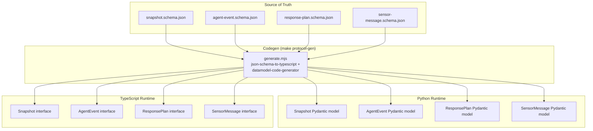
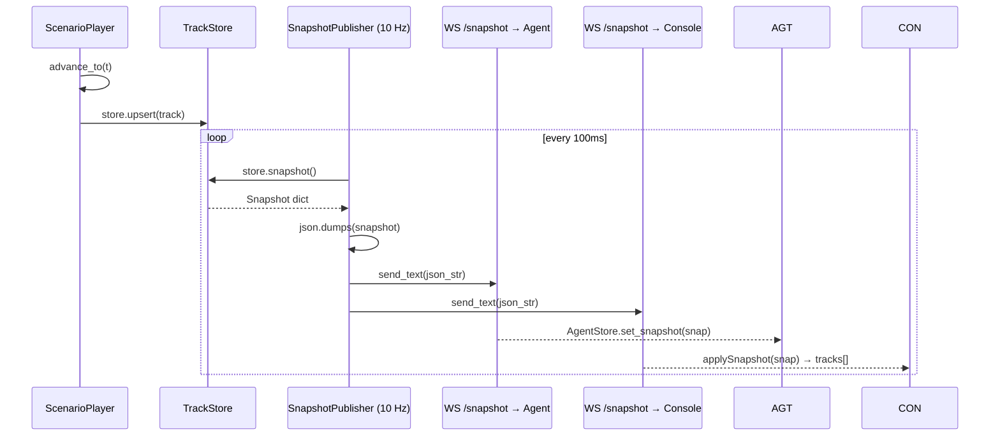
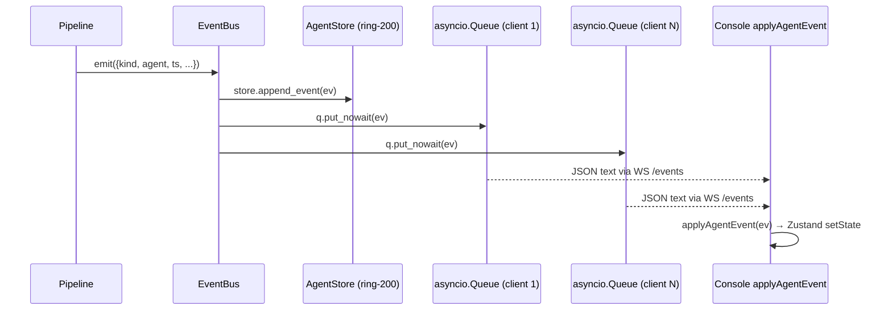
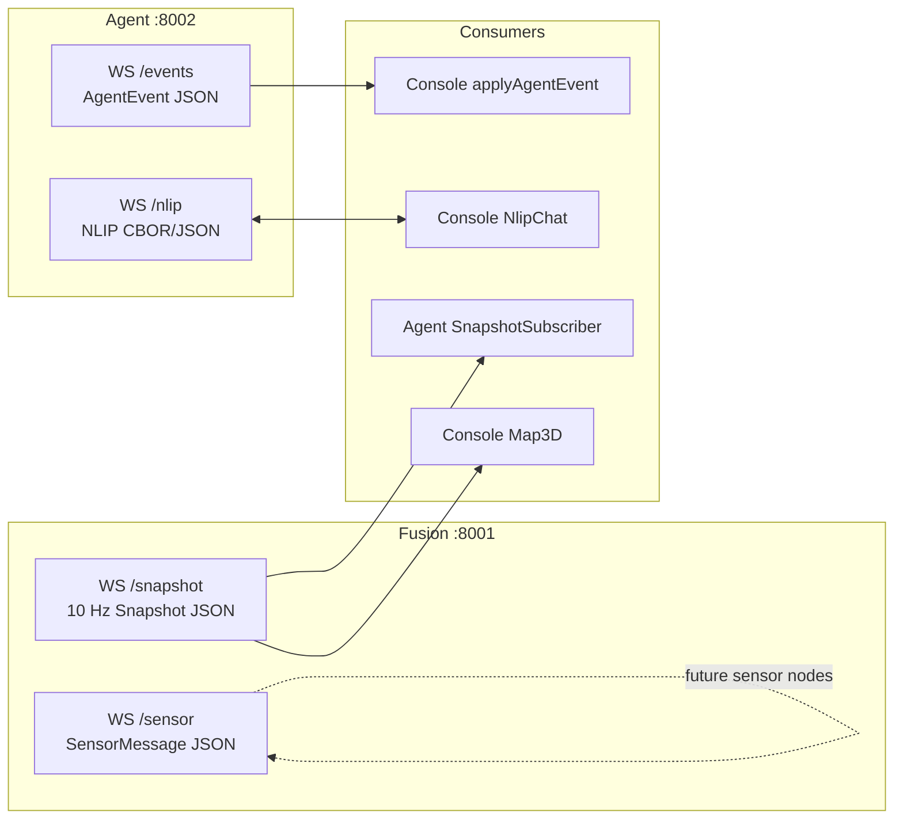

# 04 — Data Flow

This document traces data from its origin (JSON Schema) through codegen, runtime serialization, WebSocket transport, and event-sourced UI state.

---

## JSON Schema as Source of Truth

All message types in MeshShield originate from JSON Schema definitions in `packages/protocol/schemas/`. This is the single point of truth — no type is defined anywhere else.



### Why this matters

Without a shared schema, Python and TypeScript evolve independently and eventually disagree. The generated files carry:
- `# AUTO-GENERATED FROM packages/protocol/schemas — do not edit` (Python)
- `// AUTO-GENERATED FROM packages/protocol/schemas — do not edit` (TypeScript)

Any schema change triggers a codegen run (`make protocol-gen`) which simultaneously updates both runtimes. The round-trip tests in `packages/protocol/tests/` catch regressions before they reach CI.

---

## Message Lifecycle: Snapshot



The Snapshot is serialized as JSON text (not CBOR) for maximum debuggability. At 10 Hz with ~15 tracks, a snapshot is roughly 800 bytes — WebSocket framing overhead is negligible.

### Snapshot Wire Format

```json
{
  "v": 1,
  "snapshot_id": "snap-00042",
  "ts": 1714680000.250,
  "tracks": [
    {
      "id": "t-001",
      "origin": "real",
      "pos_3d": [120.4, 88.1, 35.0],
      "vel": [-8.2, -3.1, 0.0],
      "conf": 0.91,
      "nearest_asset_m": 47.2
    }
  ]
}
```

---

## Message Lifecycle: AgentEvent



The EventBus uses `put_nowait` with a `QueueFull` guard: if a subscriber is slow, events are dropped (not the publisher). Slow clients see gaps in the event tape but never block the pipeline.

### AgentEvent Wire Format

```json
{
  "kind": "tool_call_finished",
  "agent": "allocator",
  "tool": "simulate_intercept_path",
  "ms": 312,
  "result_summary": "t-001→i-002: 2.1s intercept",
  "ts": 1714680002.1
}
```

The `plan_ready` event includes the full `ResponsePlan` inline:
```json
{
  "kind": "plan_ready",
  "plan_id": "plan-a1b2c3d4",
  "plan": { "v": 1, "plan_id": "...", "assignments": [...], "escalation": {...} },
  "ts": 1714680002.8
}
```

This means the console never needs to make a separate HTTP request for the plan — it arrives via the event stream.

---

## Event-Sourced UI State

The console Zustand store is fully event-sourced:

```mermaid
flowchart LR
  WS[WS /events stream] -->|JSON text| PARSE[JSON.parse]
  PARSE -->|AgentEvent| APPLY[applyAgentEvent<br/>pure reducer]
  APPLY --> STORE[(Zustand state)]

  STORE --> AGENTS[agents map<br/>Record<AgentName, AgentView>]
  STORE --> TRACKS[tracks array]
  STORE --> PLAN[ResponsePlan]
  STORE --> TAPE[AgentEvent[]<br/>last 500]

  AGENTS --> THEATRE[ActivityTheatre<br/>react-flow]
  TRACKS --> MAP[Map3D deck.gl]
  PLAN --> PLANPANEL[PlanPanel]
  TAPE --> EVENTTAPE[EventTape]
```

### The Reducer

`applyAgentEvent` is a pure function: `(AgentEvent) → void` (modifies Zustand state via `setState`):

```typescript
switch (ev.kind) {
  case "stage_started":
    updateAgent(ev.agent, { state: "thinking" });
    break;
  case "stage_finished":
    updateAgent(ev.agent, { state: "done", lastMessage: ev.output_summary });
    break;
  case "tool_call_started":
    updateAgent(ev.agent, {
      state: "tool_calling",
      tools: [...a.tools, { tool: ev.tool, state: "running" }]
    });
    break;
  case "plan_ready":
    plan = ev.plan as ResponsePlan;
    break;
  // ...
}
return { ...s, tape, agents, plan };
```

### Why Event Sourcing Enables Free Replay

The `tape` slice of the store holds the last 500 events. Because the store is purely derived from events:

1. **Playwright E2E** — the fake fixture in `e2e/fixtures/fake-fusion-and-agent.mjs` emits a pre-recorded event sequence over WebSocket. No real services needed.
2. **Time-travel debugging** — clicking an event in the EventTape can reconstruct the store state at that moment by replaying all events up to that point.
3. **Recording** — export the tape, play it back in a new session, get an identical demo.

---

## WebSocket Channel Map



| Channel | Direction | Format | Rate |
|---|---|---|---|
| `WS /snapshot` | Fusion → Agent, Console | JSON text | 10 Hz |
| `WS /sensor` | Edge nodes → Fusion | JSON text | As-received (future) |
| `WS /events` | Agent → Console | JSON text | Event-driven |
| `WS /nlip` | Console ↔ Agent | CBOR or JSON | On-demand |

---

## Reconnect and Backpressure

### Agent SnapshotSubscriber

Implements exponential backoff reconnect (500 ms → 5 s max). On reconnect, it simply resumes subscribing — no message replay from Fusion (snapshots are idempotent, the latest one is always correct).

### Console Agent Stream (`lib/streams/agent.ts`)

```typescript
const open = () => {
  ws = new WebSocket(url);
  ws.onopen = () => { backoff = 500; };
  ws.onclose = () => {
    if (!stopped) setTimeout(open, backoff = Math.min(backoff * 2, 5000));
  };
};
```

The EventBus provides late-join replay (50 events on connect) so the console always starts with context even after a disconnect.

### EventBus Backpressure

The EventBus uses `asyncio.Queue(maxsize=512)` per subscriber. If a subscriber's queue fills (WebSocket client too slow), `put_nowait` raises `QueueFull` and the event is dropped for that subscriber. The publisher is never blocked.

---

## Round-Trip Test Coverage

The round-trip tests in `packages/protocol/tests/test_roundtrip.py` verify that data serialized by Python can be deserialized back to the same shape, and vice versa:

```python
def test_snapshot_roundtrip():
    data = json.loads(FIXTURE_PATH.read_text())
    snap = Snapshot.model_validate(data)
    dumped = snap.model_dump()
    assert dumped["v"] == data["v"]
    assert len(dumped["tracks"]) == len(data["tracks"])
```

The TypeScript test (`ts/src/__tests__/roundtrip.test.ts`) asserts type compatibility at compile time:
```typescript
const snap: Snapshot = fixture as Snapshot;   // compile error if schema drifted
```
