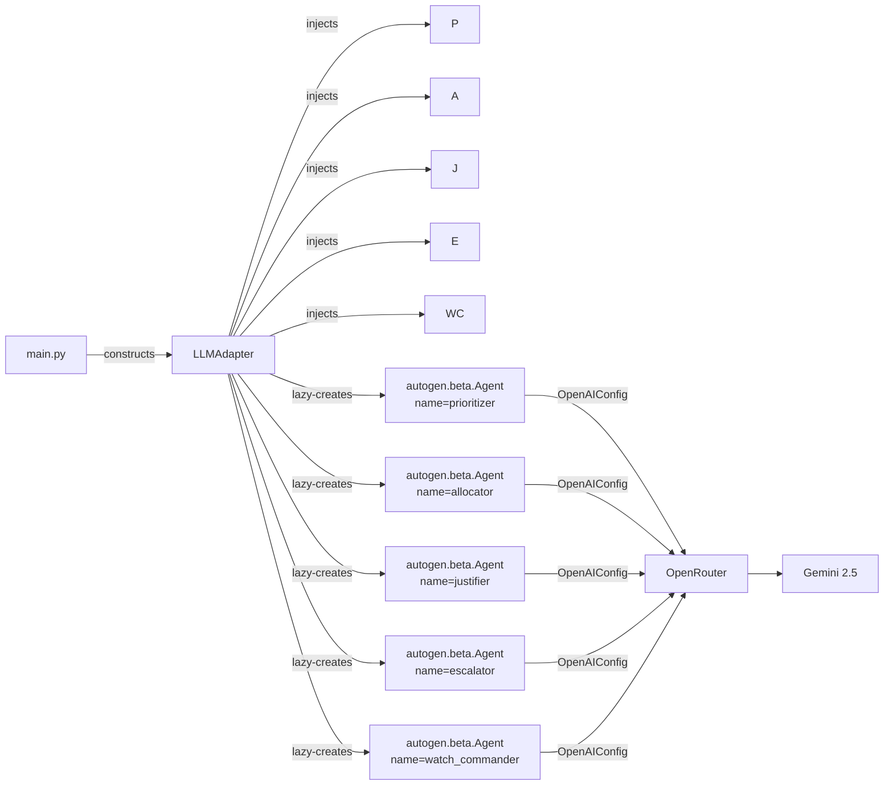

# 05 — Frameworks and APIs Used

Every framework, library, and external API in MeshShield, mapped to its role in the system, where it appears in the code, and why it was chosen.

---

## Overview

```mermaid
flowchart LR
  subgraph "Reasoning"
    AG2[AG2<br/>autogen.beta]
    OR[OpenRouter]
    GEM[Gemini 2.5<br/>Flash/Pro]
    AG2 --> OR --> GEM
  end

  subgraph "External Tools"
    TAV[Tavily Search API]
    DAYT[Daytona sandbox]
  end

  subgraph "Operator Protocol"
    NLIP[NLIP<br/>Ecma-430/431/432]
  end

  subgraph "Python Services"
    FA[FastAPI]
    UV[uvicorn]
    PY[Pydantic v2]
    CBR[cbor2]
    HTTP[httpx]
  end

  subgraph "Console"
    NX[Next.js 15]
    RF[react-flow]
    DGL[deck.gl]
    FM[Framer Motion]
    ZU[Zustand]
    RE[recharts]
    CB[cbor-x]
  end

  subgraph "Schema + Codegen"
    JS[JSON Schema<br/>draft 2020-12]
    DMC[datamodel-code-generator]
    JSTT[json-schema-to-typescript]
    JS --> DMC & JSTT
  end

  subgraph "Testing"
    PT[pytest]
    PA[pytest-asyncio]
    RX[respx]
    VT[vitest]
    TL[@testing-library/react]
    PW[Playwright]
  end

  subgraph "Workspace"
    PNPM[pnpm workspaces]
    UVW[uv]
  end
```

---

## Framework Reference Table

### Agent Orchestration

| Framework / API | Version | Role | Code Location | Why Chosen |
|---|---|---|---|---|
| **AG2** (`autogen.beta`) | latest | Four-agent pipeline + Watch Commander. One `autogen.beta.Agent` instance per named agent, wired to OpenRouter. | `apps/agent/src/agent/llm/ag2_adapter.py` | Industry-standard multi-agent framework for the hackathon; lazy-import pattern keeps tests offline. |
| **OpenRouter** | — | Translates AG2's `OpenAIConfig` calls to Gemini API. Single API key for all models. | `_AG2LLM._ensure_loaded()` in `ag2_adapter.py` | Avoids GCP project setup; supports 200+ models; OpenAI-compatible base URL. |
| **Gemini 2.5 Flash** | — | LLM for Prioritizer, Allocator, Justifier, Escalator. | `main.py`: `AG2_MODEL_FAST` env var | Fast inference; strong JSON instruction following; generous context window for full snapshot injection. |
| **Gemini 2.5 Pro** | — | LLM for Watch Commander. | `main.py`: `AG2_MODEL_PRO` env var | Higher NL quality for operator-facing responses where citation accuracy matters. |

### External Tools

| Framework / API | Role | Code Location | Why Chosen |
|---|---|---|---|
| **Tavily Search API** | Live counter-drone news grounding for the Justifier. Returns `[{title, snippet, url}]` headlines. 1-hour bucket cache. | `apps/agent/src/agent/tools/tavily.py` | Dedicated search API with structured results; no web scraping; `search_depth=basic` for low latency. |
| **Daytona** | Hosts the `simulate_intercept_path` FastAPI shim. Provides sandboxed execution for the ballistic simulation tool. | `apps/agent/src/agent/tools/intercept_sim.py` | Hackathon requirement; local numpy fallback means demo resilience when Daytona is unavailable. |

### Operator Protocol

| Framework / API | Role | Code Location | Why Chosen |
|---|---|---|---|
| **NLIP** (`nlip-server`, Ecma-430/431/432) | Wire protocol for operator NL chat with Watch Commander. HTTP + WebSocket+CBOR bindings. | `apps/agent/src/agent/nlip/server.py` | Published ECMA standard; transport-agnostic; enables future federation; separates speaking from thinking cleanly. |

### Python Services

| Framework / Library | Role | Code Location | Why Chosen |
|---|---|---|---|
| **FastAPI** | HTTP + WebSocket server framework for both Fusion (:8001) and Agent (:8002). | `apps/fusion/src/fusion/server.py`, `apps/agent/src/agent/server.py` | Native async; WebSocket support; Pydantic integration; auto-generated OpenAPI docs. |
| **uvicorn** | ASGI server running FastAPI. | `Makefile`, `pyproject.toml` | Reference ASGI implementation; hot reload via `--reload`; works with uvloop for production. |
| **Pydantic v2** | Request/response validation in both services. Generated from JSON Schema by `datamodel-code-generator`. | `packages/protocol/python/meshshield_protocol/` | V2 is 5–10× faster than v1; `model_validate` + `model_dump` for round-trip; tight JSON Schema integration. |
| **cbor2** | CBOR serialization/deserialization for NLIP WebSocket frames. | `apps/agent/src/agent/nlip/server.py` | ECMA-432 specifies CBOR as the binary encoding; `cbor2` is the reference Python implementation. |
| **httpx** | Async HTTP client for Tavily and Daytona calls. | `apps/agent/src/agent/tools/tavily.py`, `tools/intercept_sim.py` | Sync interface used here (tool calls are sync); supports timeouts and keep-alive; mocked in tests via `respx`. |
| **websockets** | WebSocket client in `SnapshotSubscriber`. | `apps/agent/src/agent/snapshot_subscriber.py` | Low-level; predictable reconnect semantics; no framework overhead. |

### Console (Next.js / React)

| Framework / Library | Role | Code Location | Why Chosen |
|---|---|---|---|
| **Next.js 15** (App Router) | Full-stack React framework. SSR shell; all live panels are client components. | `apps/console/app/`, `next.config.mjs` | Zero-config TypeScript; App Router for clean layout nesting; SSR means instant first paint. |
| **React 18** | Component model. | All `components/` | — |
| **TypeScript** | Type safety. Types generated from JSON Schema. | All `*.ts`, `*.tsx` | — |
| **Tailwind CSS** | Utility-first styling. Custom `bg-panel`, `ring-accent`, `text-muted` tokens. | `tailwind.config.ts`, `globals.css` | Rapid iteration; no CSS-in-JS overhead; dark-mode-first. |
| **react-flow** | Activity Theatre DAG. Four agent nodes, animated handoff edges. | `components/ActivityTheatre.tsx` | First-class animated edges; custom node types; built-in zoom/pan controls. |
| **deck.gl** | 3D airspace map. `ScatterplotLayer` for tracks, `GeoJsonLayer` for asset polygon. | `components/Map3D.tsx` | GPU-accelerated; handles thousands of points; integrates with MapLibre for tile map base. |
| **react-map-gl / MapLibre** | Map tile base layer for deck.gl. | `components/Map3D.tsx` | Free tiles (no Mapbox token); OSM-based; works offline with cached tiles. |
| **Framer Motion** | Card state animations, ToolChip slide-in, escalation modal. | `components/AgentCard.tsx`, `ToolChip.tsx`, `EscalationBanner.tsx` | Declarative spring animations; `AnimatePresence` for mount/unmount; `layout` prop for reflow transitions. |
| **Zustand** | Event-sourced global state store. `applyAgentEvent` is the reducer. | `lib/store/index.ts` | Minimal boilerplate; no context provider wrapping; works outside React (in stream handlers). |
| **recharts** | Cost-curve overlay. Two `Line` series: attacker (linear) vs defender (flat). | `components/CostCurveOverlay.tsx` | Simple composable charts; lightweight; no D3 required. |
| **cbor-x** | CBOR encoding/decoding for NLIP WebSocket frames (TypeScript side). | `lib/nlip/client.ts` | Fastest CBOR implementation for Node/browser; matches `cbor2` on the Python side. |

### JSON Schema Codegen

| Tool | Role | Code Location | Docs |
|---|---|---|---|
| **JSON Schema draft 2020-12** | Message type definitions. Source of truth. | `packages/protocol/schemas/*.schema.json` | https://json-schema.org/draft/2020-12 |
| **datamodel-code-generator** | Generates Pydantic v2 `BaseModel` classes from JSON Schema. | `packages/protocol/scripts/generate.mjs` | https://koxudaxi.github.io/datamodel-code-generator/ |
| **json-schema-to-typescript** | Generates TypeScript interfaces from JSON Schema. | `packages/protocol/scripts/generate.mjs` | https://github.com/bcherny/json-schema-to-typescript |

### Testing

| Framework | Role | Code Location | Notes |
|---|---|---|---|
| **pytest** | Python test runner. | `apps/*/tests/`, `packages/*/tests/` | 52 tests collected |
| **pytest-asyncio** | `async def` test support. | — | All agent tests are async |
| **respx** | Mock `httpx` requests. Used to mock Tavily and Daytona in tests. | `apps/agent/tests/test_tools_tavily.py`, `test_tools_intercept_sim.py` | Hermetic — no network |
| **vitest** | TypeScript/React test runner. | `apps/console/vitest.config.ts` | 20 tests; compatible with `@testing-library` |
| **@testing-library/react** | Component testing utilities. | `apps/console/tests/components/` | Queries by role/text for accessibility-first tests |
| **Playwright** | E2E browser automation. | `apps/console/e2e/scenario.spec.ts` | 2 spec files; fake backend fixture eliminates live service dependency |

### Workspace and Build

| Tool | Role | Notes |
|---|---|---|
| **pnpm workspaces** | JavaScript monorepo. `@meshshield/console`, `@meshshield/protocol`, `@meshshield/scenarios`. | `pnpm-workspace.yaml` |
| **uv** | Python dependency management and virtual environments. Polyglot monorepo with pnpm. | `pyproject.toml`, `uv.lock` |
| **concurrently** | `make dev` starts all three services in one terminal. | `package.json` `dev` script |

---

## AG2 Deep-Dive: How We Use It

See [docs/AG2.md](../AG2.md) for the full deep-dive. Summary:

1. **One `LLMAdapter` instance** per service startup, shared by all four pipeline agents
2. **One `autogen.beta.Agent`** created per named agent on first call (keyed by `agent_name`)
3. All agents share the same `OpenAIConfig` (same model + API key) but have separate conversation state
4. `LLMAdapter.ask_json()` calls `ask()` then extracts the first `{...}` block — handles fenced code output from the model
5. Tests inject `CassetteLLM` directly — no AG2 import, no network



## NLIP Deep-Dive: How We Use It

See [docs/architecture/03-nlip-integration.md](03-nlip-integration.md) for the full deep-dive. Summary:

- NLIP handles the **operator boundary only** — it is the wire protocol between the console and the Watch Commander
- AG2 handles **all internal reasoning** — the Watch Commander is still an `autogen.beta.Agent` internally
- The NLIP server (`nlip/server.py`) is ~57 lines; it deserializes NLIP messages, calls `WatchCommander.respond()`, and re-serializes the answer
- Binary (CBOR) and text (JSON) frames are both supported and auto-detected

## Daytona Deep-Dive: How We Use It

Daytona runs a FastAPI shim at `DAYTONA_BASE_URL`. The shim exposes `POST /sim` and accepts:
```json
{ "track": {...track_state}, "interceptor": {...interceptor_state} }
```

It returns:
```json
{ "intercept_ts": 2.1, "miss_distance_m": 3.4, "energy_j": 180000 }
```

The MeshShield client (`tools/intercept_sim.py`) adds `"source": "daytona"` to tag the provenance. If the call times out (1.5 s default) or raises any exception, the local numpy fallback runs and returns `"source": "local-fallback"`. The Allocator collects `_sim_sources` and the console renders a badge on the AgentCard.

## Tavily Deep-Dive: How We Use It

Tavily is called by the Justifier with:
```json
{
  "query": "counter-drone threat news in us-west past 72 hours",
  "search_depth": "basic",
  "max_results": 5,
  "topic": "news"
}
```

Results are cached in a Python dict keyed by `(region, hours, hour_bucket)`. The hour bucket rolls over every 3600 seconds, so stale headlines don't persist longer than an hour. If `TAVILY_API_KEY` is absent, the tool returns an empty list — the Justifier still runs, just without external grounding.
