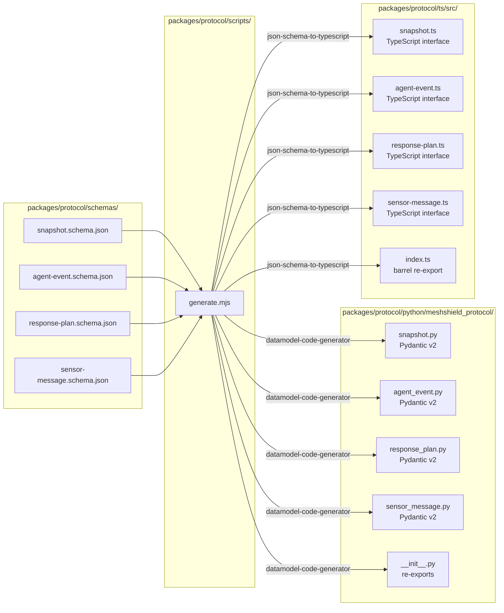

# Protocol Package

**Path:** `packages/protocol/`  
**Role:** Single source of truth for all inter-service message schemas. JSON Schema → Pydantic + TypeScript via codegen. Round-trip tests catch schema drift in CI.

---

## Why JSON Schema as Source of Truth

MeshShield has three runtimes that must agree on message shapes:

1. **Fusion service** (Python) — publishes `Snapshot`, accepts `SensorMessage`
2. **Agent service** (Python) — emits `AgentEvent`, reads `Snapshot`, writes `ResponsePlan`
3. **Console** (TypeScript) — consumes `AgentEvent`, `Snapshot`, `ResponsePlan`

Without a single source of truth, types drift. This package solves that by defining four schemas in JSON Schema draft 2020-12, then generating Pydantic v2 models and TypeScript interfaces from them automatically.

---

## Codegen Flow



### Running codegen

```bash
# From repo root
make protocol-gen

# Manually
node packages/protocol/scripts/generate.mjs
```

The script:
1. Uses `json-schema-to-typescript` to compile each `.schema.json` → `.ts` interface and writes a barrel `index.ts`
2. Uses `uv run datamodel-codegen` to compile each `.schema.json` → Pydantic v2 `BaseModel` class
3. Writes a `__init__.py` that re-exports all four top-level types under stable names

All generated files carry the header `// AUTO-GENERATED FROM packages/protocol/schemas — do not edit`.

---

## The Four Schemas

### `Snapshot`

Published by Fusion at 10 Hz; consumed by Agent service and Console.

```json
{
  "v": 1,
  "snapshot_id": "snap-00042",
  "ts": 1714680000.250,
  "tracks": [
    {
      "id": "t-001",
      "origin": "real",
      "pos_3d": [120.4, 88.1, 35.0],
      "vel": [-8.2, -3.1, 0.0],
      "conf": 0.91,
      "nearest_asset_m": 47.2
    }
  ]
}
```

Key design decisions:
- `origin: "real" | "simulated"` — distinguishes sensor-fused tracks from scenario-injected ones
- `conf` is 0–1 confidence; used by Escalator's policy gate
- `nearest_asset_m` is pre-computed by the Fusion service so agents don't need geometry

### `AgentEvent`

Emitted by the Agent service EventBus; consumed by the Console WebSocket stream.

```json
{
  "kind": "stage_finished",
  "agent": "allocator",
  "output_summary": "{'allocations': [{'target_id': 't-001', ...",
  "ms": 1240,
  "ts": 1714680002.5
}
```

Eight event kinds:

| Kind | Purpose |
|---|---|
| `stage_started` | Agent begins thinking |
| `stage_finished` | Agent produced output |
| `stage_failed` | Agent threw an exception |
| `tool_call_started` | External tool call initiated |
| `tool_call_finished` | External tool call completed |
| `agent_message` | Intermediate LLM message |
| `plan_ready` | Full `ResponsePlan` attached (console renders without extra fetch) |
| `escalation_raised` | Escalation required; reason string included |

### `ResponsePlan`

The final output of one pipeline tick.

```json
{
  "v": 1,
  "plan_id": "plan-a1b2c3d4",
  "snapshot_id": "snap-00042",
  "ts": 1714680002.8,
  "assignments": [
    {
      "target_id": "t-001",
      "interceptor_id": "i-002",
      "mode": "kinetic",
      "priority": 1,
      "justification": "high conf approach vector; policy clause:auto_engage_conf satisfied"
    }
  ],
  "escalation": {
    "required": false,
    "reasons": []
  }
}
```

### `SensorMessage`

Accepted by Fusion on `WS /sensor` (no-op in v1; implemented in sub-projects B/C).

```json
{
  "v": 1,
  "node_id": "laptop-01",
  "ts": 1714680000.123,
  "detections": [
    { "class": "drone", "conf": 0.91, "bearing_deg": 142.5, "elev_deg": 8.3, "px_box": [320, 180, 80, 60] }
  ]
}
```

---

## Round-trip Tests

```bash
# Python round-trip
uv run pytest packages/protocol/tests/ -v

# TypeScript round-trip
pnpm --filter @meshshield/protocol test
```

The Python tests (`test_roundtrip.py`) serialize fixture data through Pydantic models and assert that deserialization produces the same object. `test_schemas_load.py` validates the JSON Schema itself. `test_codegen.py` checks that generated files exist and contain expected class names.

The TypeScript test (`ts/src/__tests__/roundtrip.test.ts`) imports the generated interfaces and asserts fixture data satisfies them at compile time via `as` casts — catching any type incompatibility before it ships.

---

## How to Add a New Schema

1. Create `packages/protocol/schemas/my-message.schema.json` following JSON Schema draft 2020-12
2. Run `make protocol-gen`
3. Import from `@meshshield/protocol` (TS) or `from meshshield_protocol import MyMessage` (Python)
4. Add a fixture in `packages/protocol/tests/fixtures/` and a round-trip test

The codegen script will pick up any new `.schema.json` file automatically.
