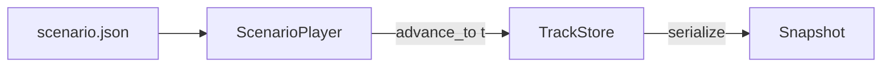
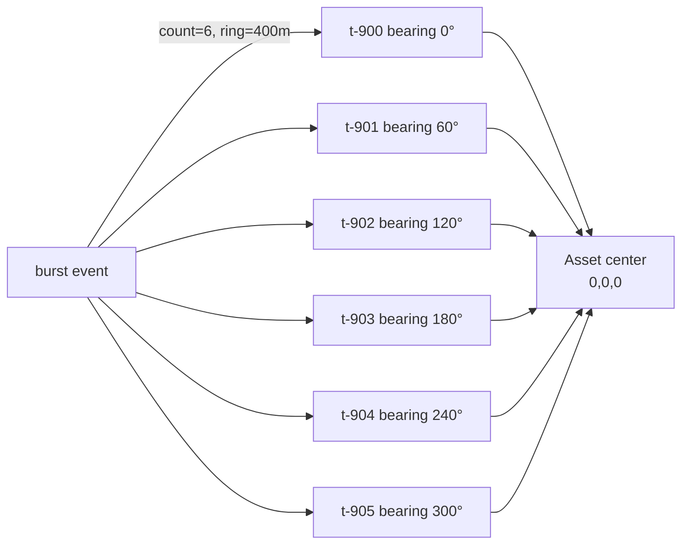

# Scenarios Package

**Path:** `packages/scenarios/`  
**Role:** Pre-baked scenario files for the Fusion service, OSM asset polygons, and policy thresholds. No runtime code — pure data consumed by the Python services.

---

## What's in This Package

```
packages/scenarios/
├── data-center-swarm-attack.json   # Default scenario: 8-drone + 6-drone burst swarm
├── policy.json                     # Escalation and auto-action policy thresholds
├── index.js                        # Node.js barrel (lists available scenarios)
├── assets/
│   └── osm-datacenter.geojson      # OSM-sourced polygon for "Hyperscaler DC East"
└── scripts/
    └── fetch_osm.py                # Helper to refresh the GeoJSON from Overpass API
```

---

## Scenario File Format

A scenario file drives the `ScenarioPlayer` in the Fusion service. It defines the protected asset, available interceptors, and a timed event sequence.



### Full Schema

```json
{
  "v": 1,
  "scenario_id": "data-center-swarm-attack",
  "duration_s": 30,

  "asset": {
    "asset_id": "datacenter-A",
    "name": "Hyperscaler DC East",
    "center_xyz": [0.0, 0.0, 0.0],
    "radius_m": 60.0
  },

  "interceptors": [
    { "id": "i-001", "kind": "rf_jam",  "pos_3d": [-50, -10, 0], "range_m": 250 },
    { "id": "i-002", "kind": "kinetic", "pos_3d": [ 50, -10, 0], "range_m": 200 },
    { "id": "i-003", "kind": "spoof",   "pos_3d": [-10,  60, 0], "range_m": 300 },
    { "id": "i-004", "kind": "rf_jam",  "pos_3d": [ 10,  60, 0], "range_m": 250 }
  ],

  "events": [
    { "t": 0.0, "spawn": { ... } },
    { "t": 6.0, "spawn": { ... } },
    { "t": 18.0, "burst": { ... } }
  ]
}
```

### Event Types

#### `spawn` — Single track

```json
{
  "t": 0.0,
  "spawn": {
    "id": "t-001",
    "origin": "real",
    "pos_3d": [200, 150, 50],
    "vel": [-12, -9, 0.0],
    "conf": 0.92
  }
}
```

| Field | Type | Description |
|---|---|---|
| `id` | string | Track ID (must be unique within scenario) |
| `origin` | `"real" \| "simulated"` | `"real"` = sensor-detected; `"simulated"` = scenario-injected |
| `pos_3d` | `[x, y, z]` floats | Position in metres relative to asset center |
| `vel` | `[vx, vy, vz]` floats | Velocity in m/s |
| `conf` | float 0–1 | Detection confidence |

#### `burst` — Radially symmetric swarm

```json
{
  "t": 18.0,
  "burst": {
    "count": 6,
    "ring_radius_m": 400,
    "altitude_m": 50,
    "speed_m_s": 11,
    "origin": "simulated",
    "id_prefix": "t-9"
  }
}
```

The `ScenarioPlayer` fans this into `count` tracks placed evenly around a circle of radius `ring_radius_m`, all converging inward. Track IDs are `{id_prefix}00` through `{id_prefix}05`. This models a coordinated swarm attack from multiple bearings simultaneously.



---

## The Default Scenario: `data-center-swarm-attack`

Timeline (30 seconds):

| Time | Event | Count | Notes |
|---|---|---|---|
| 0.0 s | `t-001` spawns | 1 | High confidence (0.92), direct approach |
| 0.5 s | `t-002` spawns | 1 | Simulated, approaching from NW |
| 1.0 s | `t-003` spawns | 1 | Approaching from SE |
| 1.5 s | `t-004` spawns | 1 | Low confidence (0.66), descending |
| 6.0 s | `t-005` spawns | 1 | Directly east |
| 6.5 s | `t-006` spawns | 1 | Directly west |
| 9.0 s | `t-007` spawns | 1 | High confidence (0.83), from north |
| 9.5 s | `t-008` spawns | 1 | Low confidence (0.59), from south |
| 18.0 s | Burst fires | 6 | Coordinated ring attack at 400 m radius |

Maximum tracks: 14 (`t-001` through `t-008` + `t-900` through `t-905`).

---

## Policy File

`policy.json` sets the thresholds used by the Escalation Officer's deterministic pre-check:

```json
{
  "auto_action_min_conf": 0.7,
  "escalate_if_tracks_per_asset_gt": 10,
  "kinetic_requires_human": false,
  "policy_version": "v1.0.0"
}
```

| Key | Default | Meaning |
|---|---|---|
| `auto_action_min_conf` | `0.7` | Tracks below this confidence trigger escalation |
| `escalate_if_tracks_per_asset_gt` | `10` | More than N tracks within 60 m → escalation |
| `kinetic_requires_human` | `false` | If true, any kinetic assignment triggers escalation |

---

## OSM GeoJSON

`assets/osm-datacenter.geojson` is a real polygon from OpenStreetMap representing a data-center campus. It is rendered as a red overlay on the `Map3D` component using deck.gl's `GeoJsonLayer`.

The file was fetched with the Overpass API via `scripts/fetch_osm.py`:

```bash
python packages/scenarios/scripts/fetch_osm.py
```

This queries Overpass for buildings tagged `building=data_center` near a reference coordinate and writes the first result as `osm-datacenter.geojson`. Re-run to refresh if the OSM data changes.

---

## How to Author a New Scenario

1. Copy `data-center-swarm-attack.json` to a new file, e.g. `airport-perimeter.json`
2. Set `scenario_id` to a unique string
3. Define the `asset.center_xyz` as the protected location origin `[0, 0, 0]`
4. Add interceptors with their positions relative to the asset
5. Add `spawn` and `burst` events in chronological order
6. Set `SCENARIO=airport-perimeter` in `.env` and restart services

The Fusion service reads `SCENARIO` on startup:
```python
SCENARIO = ROOT / "packages/scenarios" / f"{os.getenv('SCENARIO','data-center-swarm-attack')}.json"
```

---

## Tests

```bash
uv run pytest packages/scenarios/tests/ -v
```

`test_scenario_loads.py` validates that all scenario JSON files can be loaded and that required top-level keys are present.
